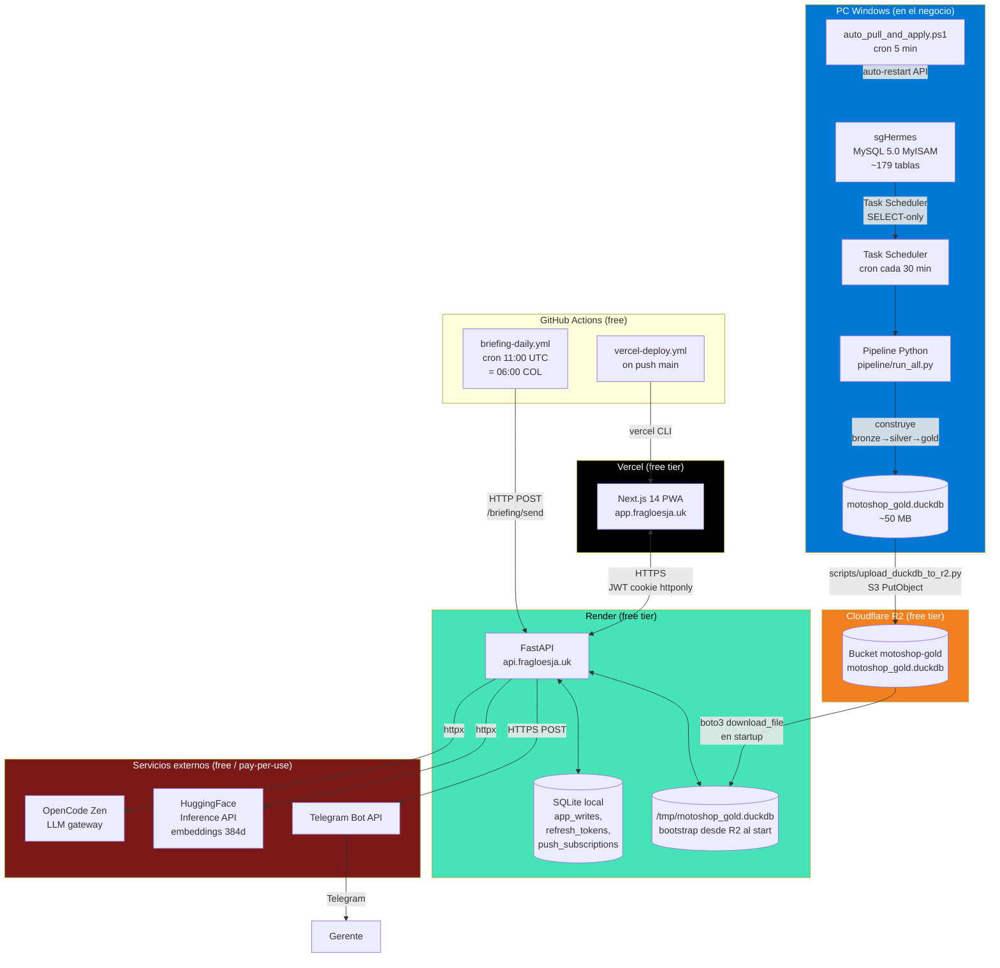
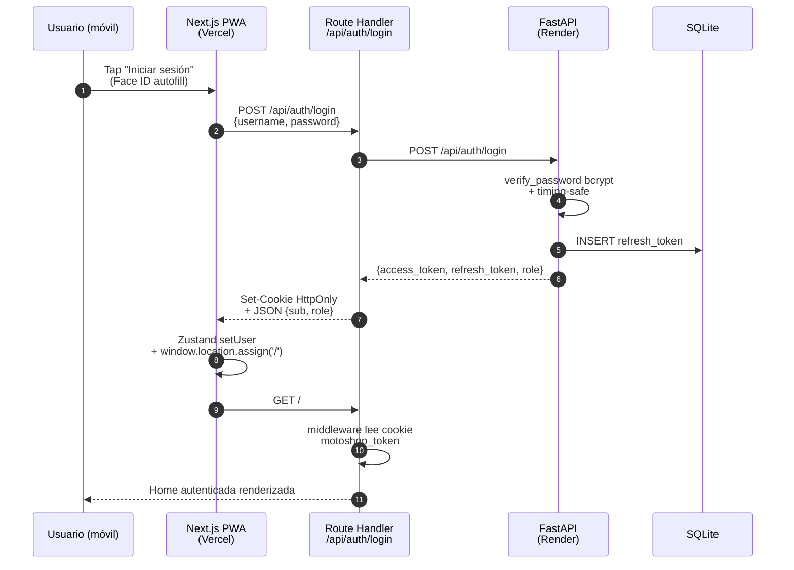
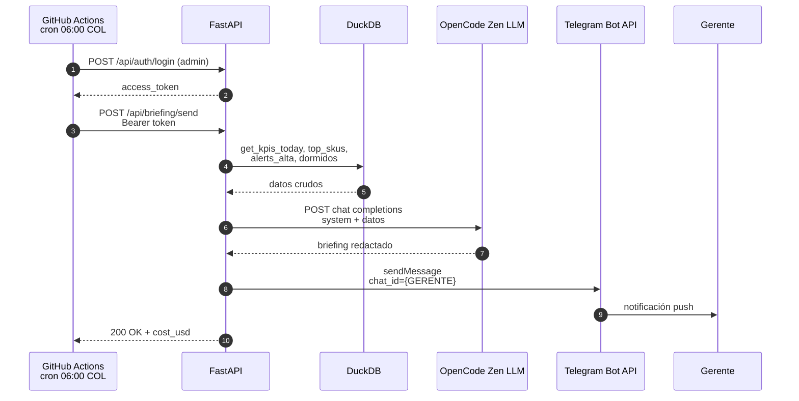
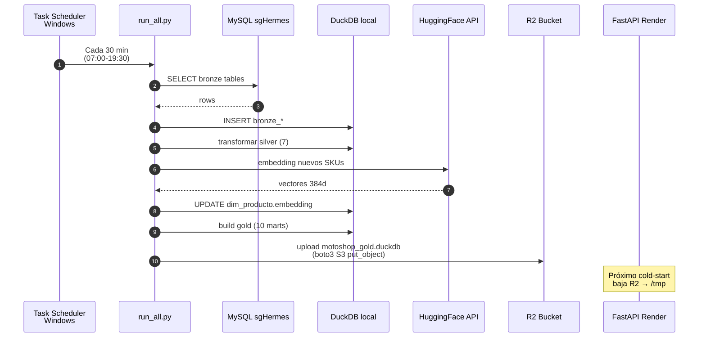
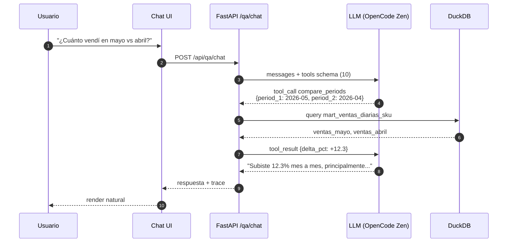

# MotoShop · Plataforma de transformación digital

> **Repuestos de moto, Cali, Colombia.** Un ERP de escritorio (`sgHermes` sobre MySQL 5.0) que solo se podía consultar desde el PC del negocio, convertido en un sistema accesible desde cualquier lugar con dashboards, briefing por Telegram, búsqueda semántica, forecast, chat con IA — y todo corriendo a **$0/mes de infraestructura recurrente**.

> **Documentos vivos del proyecto.** Estado al día: [`SEGUIMIENTO.md`](SEGUIMIENTO.md) · Backlog del PO: [`PENDIENTES.md`](PENDIENTES.md) · Índice maestro de planes y ADRs: [`docs/MASTER.md`](docs/MASTER.md) · Plan canónico actual: [`docs/plan-v1.7-observability.md`](docs/plan-v1.7-observability.md).

```
sgHermes (Windows, MySQL 5.0)  ─────►  Pipeline ETL (DuckDB)  ─────►  Cloudflare R2
                                                                            │
                                                                            ▼
                                                                  ┌──────────────────┐
                                                                  │  API FastAPI     │  ←── Render free
                                                                  │  (api.fragloesja.uk) │
                                                                  └────────┬─────────┘
                                                                           │
                                          ┌────────────────────────────────┼─────────────────────┐
                                          ▼                                ▼                     ▼
                                   PWA Next.js                      Bot Telegram          OpenCode Zen
                                  (Vercel free)                    (briefing 06:00)         (LLM)
                                          │
                                       Gerente
```

---

## 1 · Índice

1. [Visión](#2--visión)
2. [Arquitectura — vista completa](#3--arquitectura--vista-completa)
3. [Stack tecnológico](#4--stack-tecnológico)
4. [Componentes](#5--componentes)
   - [PC Windows · origen del dato](#51--pc-windows--origen-del-dato)
   - [Pipeline ETL · Bronze → Silver → Gold](#52--pipeline-etl--bronze--silver--gold)
   - [Cloudflare R2 · transporte del DuckDB](#53--cloudflare-r2--transporte-del-duckdb)
   - [Backend · FastAPI + DuckDB embebido](#54--backend--fastapi--duckdb-embebido)
   - [Frontend · Next.js 14 PWA](#55--frontend--nextjs-14-pwa)
   - [Capa IA · embeddings + LLM + briefing](#56--capa-ia--embeddings--llm--briefing)
   - [Telegram bot · entrega diaria](#57--telegram-bot--entrega-diaria)
   - [Auto-deploy · GitHub Actions](#58--auto-deploy--github-actions)
5. [Modelo de datos](#6--modelo-de-datos)
6. [Catálogo de endpoints API](#7--catálogo-de-endpoints-api)
7. [Catálogo de rutas frontend](#8--catálogo-de-rutas-frontend)
8. [Flujos críticos · diagramas de secuencia](#9--flujos-críticos--diagramas-de-secuencia)
9. [Deploy y operación](#10--deploy-y-operación)
10. [Cómo el costo es $0/mes](#11--cómo-el-costo-es-0mes)
11. [Variables de entorno](#12--variables-de-entorno)
12. [Quickstart local](#13--quickstart-local)
13. [Estructura del repositorio](#14--estructura-del-repositorio)
14. [Decisiones de arquitectura](#15--decisiones-de-arquitectura-clave)
15. [Glosario](#16--glosario)
16. [Roadmap](#17--roadmap-actual)

---

## 2 · Visión

| Antes | Después |
|---|---|
| Solo el dueño veía las ventas del día — y solo desde el PC físico. | El gerente recibe a las 06:00 un briefing por Telegram con KPIs, alertas, recomendaciones. |
| Para saber qué SKU rotaba, había que abrir Excel y SUMAR a mano. | Dashboard ABC, dormidos, cohortes, drift, forecast — todo accesible desde el celular. |
| "¿Cuánto vendí esta semana vs la pasada?" requería 20 min de consulta. | Pregunta en lenguaje natural a un chat con IA y la respuesta viene en 2s, con cero alucinación porque la IA solo usa 10 herramientas tipadas — no toca SQL crudo. |
| Buscar un repuesto exigía saber el nombre exacto del proveedor. | Búsqueda híbrida: sinónimos + embeddings + keyword. "amortiguador trasero" encuentra el SKU aunque esté como "AMORTIG TRAS". |
| Pedir reposición se decidía por intuición. | Plan de compras automático con forecast por categoría y alertas de drift de demanda. |

**Lo que MotoShop NO hace.** `sgHermes` sigue siendo la fuente de verdad transaccional. El sistema NO modifica esquemas, datos ni permisos del MySQL productivo — solo lee. Toda escritura nuestra va a tablas `app_*` separadas. El negocio sigue facturando con sgHermes como siempre.

### Roles operativos

El proyecto se opera con un PO humano y agentes IA especializados con roles bien diferenciados. Esto NO es cosmético: define qué puede tocar cada uno y dónde para la línea.

| Rol | Quién | Qué hace | Qué NO hace |
|---|---|---|---|
| **Product Owner (PO)** | Javier (humano) | Define visión, prioriza backlog, valida entregables, decide go/no-go. | NO toca el PC Windows. NO escribe código. |
| **Reviewer / Arquitecto** | Agente IA con rol reviewer | Decisiones arquitectónicas, ADRs, auditoría de fases, GO/NO-GO técnico. | NO implementa sin handoff. |
| **Dev Backend** | Agente IA con rol dev | Implementa pipeline, repos, endpoints FastAPI, fixes de capa de datos. | NO toma decisiones arquitectónicas autónomas. |
| **Dev Frontend** | Agente IA con rol dev | Implementa UI/UX, dashboards, integración API, offline queue. | NO toma decisiones arquitectónicas autónomas. |
| **Dev W (Operación Windows)** | Agente IA con rol dev | `git pull` en el PC, restart pipeline, Scheduled Tasks, sync DuckDB a R2, backups MySQL. | NO valida producto. |

Reglas formales por rol viven en `INICIAR_AGENTE.md` e `INICIAR_REVIEWER.md` cuando existen en el repo.

---

## 3 · Arquitectura — vista completa



---

## 4 · Stack tecnológico

### Backend
| Capa | Tecnología | Versión | Por qué |
|---|---|---|---|
| Framework HTTP | FastAPI | ≥0.115 | Tipos Pydantic, OpenAPI auto, async nativo. |
| Servidor ASGI | uvicorn[standard] | ≥0.30 | Tipico en prod FastAPI, integrado con Render. |
| Validación | Pydantic | ≥2.7 | Schemas estrictos en cada endpoint. |
| ORM puntual | SQLAlchemy + aiosqlite | 2.x | Solo para SQLite local (app_writes, refresh_tokens). |
| Conector MySQL | pymysql | ≥1.1 | Para el pipeline en Windows (solo lectura sgHermes). |
| Analytics engine | DuckDB | ≥1.0 | Embebido, OLAP columnar, lee `s3://` directo si hiciera falta. |
| Auth | PyJWT + bcrypt | ≥2.8 / ≥4.1 | Access + refresh tokens, password timing-safe. |
| Rate limit | slowapi | ≥0.1.9 | 10 req/min en `/auth/login`. |
| Logs | structlog | ≥24 | JSON estructurado en producción. |
| Cache TTL | cachetools | ≥5.3 | TTLCache para queries DuckDB calientes. |
| Cliente S3 | boto3 | ≥1.34 | R2 (compatible S3) para descargar DuckDB. |
| Cliente LLM/embeddings | httpx + huggingface-hub | ≥0.27 / ≥0.25 | Sync calls a HF Inference API y OpenCode Zen. |

### Frontend
| Capa | Tecnología | Versión | Por qué |
|---|---|---|---|
| Framework | Next.js | 14.2 (App Router) | RSC + middleware + Vercel-native. |
| UI | React | 18.3 | Concurrent rendering. |
| Estado cliente | Zustand + persist | 5.x | Auth en localStorage; `hasHydrated` para evitar flicker SSR/CSR. |
| Fetching | SWR | 2.4 | Cache + revalidate; queries idempotentes y deduplicadas. |
| Estilos | Tailwind CSS | 3.x | Utility-first, design tokens en `lib/design`. |
| Charts | Recharts | 2.x | Composable, accesible. |
| Offline | idb-keyval + workbox sw | — | Cache de respuestas + cola offline de acciones. |
| E2E | Playwright | 1.x | Tests automatizados de UI. |

### Datos
| Capa | Tecnología | Rol |
|---|---|---|
| Origen | MySQL 5.0 (sgHermes) | Solo lectura. SELECT-only desde un usuario MySQL `api_read`. |
| Lake medallion | DuckDB file `.duckdb` | Bronze → Silver → Gold en un único archivo de ~50 MB. |
| Transporte | Cloudflare R2 | Bucket S3-compatible, free 10 GB storage + 10M ops/mes. |
| Writes propios | SQLite (Render) | Tokens refresh, acciones sobre alertas, push subs. |
| Embeddings | HuggingFace Inference API | `paraphrase-multilingual-MiniLM-L12-v2`, 384 dim. |

### Infra
| Servicio | Plan | Uso | Costo |
|---|---|---|---|
| Render | Free | API FastAPI + cron interno | $0 |
| Vercel | Free | PWA Next.js + CDN global | $0 |
| Cloudflare R2 | Free (10 GB) | DuckDB hosting (~50 MB) | $0 |
| HuggingFace | Free Inference API | Embeddings de 13k SKUs | $0 |
| GitHub Actions | Free 2000 min/mes | Cron briefing + auto-deploy | $0 |
| Telegram Bot API | Free | Mensajería gerente | $0 |
| OpenCode Zen | Suscripción Go | LLM gateway (Qwen 3.5, DeepSeek Pro) | Paga el PO aparte (no es infra) |
| PC Windows + MySQL | Ya existe | El negocio ya lo tenía | $0 incremental |
| **TOTAL infra recurrente** | | | **$0/mes** |

---

## 5 · Componentes

### 5.1 · PC Windows · origen del dato

> **Política operativa.** Todo lo del PC Windows lo opera el rol "Dev W" (ingeniero de datos local). El PO **NO toca el PC**.

**Hardware.** El PC del negocio en Cali, Colombia. Windows 10. Tiene `sgHermes` instalado y conectado a una base MySQL 5.0 con motor MyISAM (sin transacciones, sin foreign keys). ~179 tablas. La base `motoshop2024`.

**Lo que vive en el PC (todo bajo `C:\Users\MotoShop\Documents\javidevmoto`):**

| Componente | Archivo / Servicio | Función |
|---|---|---|
| Pipeline ETL | `pipeline/run_all.py` | Lee MySQL → genera DuckDB con capas bronze, silver, gold. |
| Refresh script | `infra/refresh_v15.ps1` | Wrapper PowerShell que ejecuta el pipeline + sube a R2. |
| Auto-pull | `infra/auto_pull_and_apply.ps1` | Cada 5 min, `git fetch + pull` si hay commits nuevos. |
| Task Scheduler | (Windows nativo) | Dispara `refresh_v15.ps1` cada 30 min entre 07:00-19:30 hora Cali. |
| Backup MySQL | `infra/backup_mysql.ps1` | Snapshot del MySQL local — protección operativa. |
| Health probe | `infra/check_health.ps1` | Verifica que el API esté arriba y los datos frescos. |
| Logs | `infra/logs/auto_pull.log` | Bitácora del auto-pull. |

**Usuario MySQL de lectura.**

```sql
-- Usuario SELECT-only sobre motoshop2024
CREATE USER 'api_read'@'localhost' IDENTIFIED BY '...';
GRANT SELECT ON motoshop2024.* TO 'api_read'@'localhost';
```

`sgHermes` sigue usando su propio usuario con permisos completos. El pipeline JAMÁS escribe al MySQL productivo.

**Flujo operativo cada 30 minutos:**

```
07:00 ─┐
07:30  │
08:00  │   Task Scheduler dispara refresh_v15.ps1
...    │   ├─ python pipeline/run_all.py
19:00  │   │  ├─ MySQL → bronze (tablas DuckDB en memoria)
19:30 ─┘   │  ├─ bronze → silver (limpieza, business_date, deduplicación)
           │  └─ silver → gold (10 marts)
           ├─ python scripts/upload_duckdb_to_r2.py
           │  └─ boto3 put_object → motoshop_gold.duckdb en R2
           └─ Log resultado en infra/logs/
```

**Auto-pull cada 5 minutos:**

```
git fetch origin main
HEAD local ≠ origin/main?
├─ NO  → exit
└─ SÍ  → git pull --ff-only
         ├─ Cambió motoshop-app/api/** → reiniciar API local (no aplica acá, API vive en Render)
         ├─ Cambió pipeline/**         → next run usa código nuevo
         └─ Cambió migrations/**       → WARN al log (humano aplica manual con backup)
```

### 5.2 · Pipeline ETL · Bronze → Silver → Gold

Pipeline 100% Python, sin Spark, sin Airflow. Todo corre en un archivo DuckDB único.

**`pipeline/run_all.py` — orquestador.**

```
1. _build_bronze_from_mysql(con)
   - Conecta MySQL 5.0 con pymysql
   - SELECT * de cada tabla relevante
   - INSERT INTO motoshop_bronze_<tabla> en DuckDB
   - Tablas: productos, bodegas, faccompras, detfcompras, facventas, detfventas,
             auxinventario, vendedores, clientes, ...

2. Silver — pipeline/silver.py
   - dim_producto:   limpia nombres, normaliza códigos
   - dim_bodega:     resuelve nom_bodega vacíos contra catálogo
   - fact_ventas:    deriva business_date (cabecera + detalle bien joined)
   - fact_ventas_detalle, fact_compras, fact_compras_detalle, fact_inventario
   - Embeddings: backup en TEMP TABLE + ALTER TABLE para sobrevivir cada run

3. Gold — pipeline/gold.py
   - mart_ventas_diarias_sku:     ventas por SKU + día
   - mart_inventario_actual:      último corte de inventario por bodega
   - mart_rotacion_abc:           clasificación ABC mensual por valor
   - mart_productos_dormidos:     SKUs sin venta hace ≥90 días
   - mart_cohortes_clientes:      retención mes a mes
   - alertas_quiebre:             SKUs con stock bajo demanda
   - alertas_drift:               cambios de patrón demanda
   - forecast_categoria:          predicción mensual por categoría
   - mart_abc_xyz:                cruce ABC (valor) × XYZ (variabilidad)
   - mart_rotacion_promedio:      días promedio de rotación
   - 10 marts en total

4. embeddings_skus.py (opcional, dispara solo si hay SKUs nuevos)
   - Calcula embedding de nom_producto via HF Inference API
   - Guarda en silver_dim_producto.embedding (vector 384 float)

5. Captura de stats (V1.7)
   - pipeline_runs.duckdb registra: stage, duration_ms, rows_in/out, errors
   - Sirve para la UI de observability en /admin/pipeline
```

**Tiempo total de un run:** ~2-4 min para 13k SKUs, 6k facturas, 50k líneas.

### 5.3 · Cloudflare R2 · transporte del DuckDB

R2 hace el papel que en otros stacks haría S3 — pero a $0 hasta 10 GB. El proyecto usa ~50 MB.

**Configuración:**
- Bucket: `motoshop-gold`
- Endpoint: `https://4bd1502b7fa3f33d1d3c45ae2d252cfd.r2.cloudflarestorage.com`
- Object: `motoshop_gold.duckdb` (raíz del bucket)

**Subida (Windows después del pipeline):**

```python
# scripts/upload_duckdb_to_r2.py
s3 = boto3.client('s3', endpoint_url=R2_ENDPOINT, ...)
s3.upload_file('motoshop_gold.duckdb', 'motoshop-gold', 'motoshop_gold.duckdb')
```

**Bajada (Render al boot):**

```python
# motoshop_api/metrics/repo_duckdb.py · _bootstrap_duckdb_from_r2
if not db_path.exists():
    s3.download_file('motoshop-gold', 'motoshop_gold.duckdb', '/tmp/motoshop_gold.duckdb')
```

El API arranca, ve `/tmp/motoshop_gold.duckdb` ausente, lo baja una vez, lo abre **read-only**, y queda servido hasta el próximo cold-start.

### 5.4 · Backend · FastAPI + DuckDB embebido

**Path:** `motoshop-app/api/src/motoshop_api/`

**Entry point:** `main.py` monta 15 routers bajo `/api`:

```python
app.include_router(auth_router,           prefix="/api")
app.include_router(pipeline_runs_router,  prefix="/api")
app.include_router(products_router,       prefix="/api")
app.include_router(stock_router,          prefix="/api")
app.include_router(sales_router,          prefix="/api")
app.include_router(catalog_router,        prefix="/api")
app.include_router(health_router,         prefix="/api")
app.include_router(llm_router,            prefix="/api")
app.include_router(metrics_router,        prefix="/api")
app.include_router(push_router,           prefix="/api")
app.include_router(forecast_router,       prefix="/api")
app.include_router(admin_router,          prefix="/api")
app.include_router(alerts_router,         prefix="/api")
app.include_router(app_writes_router,     prefix="/api")
app.include_router(purchase_plans_router, prefix="/api")
```

**Módulos por responsabilidad:**

| Módulo | Responsabilidad | Lee desde |
|---|---|---|
| `auth/` | Login JWT con bcrypt + timing-safe compare. Refresh tokens en SQLite. Rate-limit 10/min. | `users.yaml` (hashes bcrypt) |
| `products/` | Catálogo, búsqueda híbrida (sinónimos + embedding cosine + keyword LIKE). | DuckDB silver_dim_producto |
| `stock/` | Stock por SKU desglosado por bodega. | DuckDB mart_inventario_actual |
| `sales/` | Ventas recientes paginadas. | DuckDB silver_fact_ventas_detalle |
| `metrics/` | 24+ endpoints de métricas (ABC, dormidos, cohortes, drift, forecast, plan compras, etc). TTLCache 5 min. | DuckDB marts gold |
| `forecast/` | Forecast de demanda por SKU. | DuckDB gold_forecast_categoria |
| `alerts/` | Alertas de quiebre por urgencia. | DuckDB gold_alertas_quiebre |
| `app_writes/` | Acciones del gerente sobre alertas (ej: "marcar como atendida"). | SQLite app_writes |
| `purchase_plans/` | Planes de compra: el gerente cierra una compra recomendada y queda registro. | SQLite purchase_plans |
| `llm/` | Briefing + chat + explicación forecast (ver §5.6). | DuckDB + OpenCode Zen |
| `pipeline_runs/` | Observabilidad del pipeline (V1.7). | pipeline_runs.duckdb en R2 |
| `health/` | `/health/data-freshness` reporta antigüedad del último ETL. | metadata DuckDB |
| `push/` | Subs Web Push para notificaciones móviles. | SQLite push_subscriptions |
| `admin/` | Operaciones manuales de refresh + status + cost del LLM. | varios |
| `data_catalog/` | Catálogo medallion (V1.8): muestra qué tablas hay y de dónde vienen. | DuckDB metadata |

**Patrón de capa de datos.** Cada módulo `metrics`/`products` etc tiene:
- `router.py` — endpoints HTTP, deps de auth
- `schemas.py` — modelos Pydantic IN/OUT
- `repo.py` — interface abstracta
- `repo_duckdb.py` — implementación DuckDB (activa)
- (Histórico: `repo_databricks.py` antes de la migración V1.5)

Esto permite swapear backend de datos sin tocar HTTP. Cuando Databricks dejó de ser viable, swapeamos a DuckDB en un sprint.

**Cache.** Cada `metrics/*` endpoint pasa por `_cached_or_fetch(key, fn)` que usa `cachetools.TTLCache(maxsize=128, ttl=300)`. Una pregunta tipo `abc-segmentation` se ejecuta 1 vez cada 5 min aunque la pidan 100 dashboards.

### 5.5 · Frontend · Next.js 14 PWA

> **Movido a [`frontfambus`](https://github.com/javierportillar/frontfambus)** (2026-06-14). El frontend ya no vive en este repo. Esta sección queda como referencia arquitectónica; el código y la documentación operativa están en el nuevo repo. El directorio `motoshop-app/web/` se mantiene temporalmente como respaldo hasta que Vercel quede reconectado al nuevo repo y se valide el primer deploy desde ahí. Después se borra.

**Path actual del código:** [`frontfambus`](https://github.com/javierportillar/frontfambus) (raíz del repo)
**Path histórico (respaldo temporal):** `motoshop-app/web/`

**Stack interno:**
- App Router (RSC + Server Actions cuando aplica)
- Middleware (`middleware.ts`) chequea cookie httponly antes de cada ruta no-pública
- Zustand persistido en localStorage para `user`, `role`, `isAuthenticated`
- SWR para fetching con cache y revalidación
- Workbox service worker para offline (PWA installable)

**Layout de rutas (App Router):**

```
app/
├── api/                       ─── Routes server-side
│   ├── [...path]/route.ts        Proxy genérico → api.fragloesja.uk con cookie auth
│   └── auth/
│       ├── login/route.ts        POST: llama backend, setea cookie httponly
│       ├── logout/route.ts       POST: limpia cookies
│       └── refresh/route.ts      POST: rota refresh token
├── login/
│   └── page.tsx               ─── Form login (público)
└── (authenticated)/           ─── Route group con guard
    ├── layout.tsx                Renderiza Navigation + sidebar
    ├── page.tsx                  Home con KPIs + acciones del día
    ├── dashboards/
    │   ├── page.tsx              Index de dashboards
    │   ├── ventas/page.tsx       Tendencia, distribución por mes, top SKUs
    │   ├── inventario/page.tsx   Stock total, valor, por bodega
    │   ├── abc/page.tsx          Segmentación ABC con productos detallados
    │   └── dormidos/page.tsx     SKUs sin venta hace 90+ días paginado
    ├── cohortes/page.tsx         Retención de clientes mes a mes
    ├── drift/page.tsx            Categorías con cambio de patrón demanda
    ├── forecast/page.tsx         Predicción mensual con narrativa IA
    ├── plan-compras/page.tsx     Recomendación de qué pedir
    ├── alerts/page.tsx           Quiebres de stock por urgencia
    ├── acciones/page.tsx         Historial de acciones del gerente
    ├── chat/page.tsx             Q&A con 10 tools (V1.6 Sprint C)
    ├── vendedores/page.tsx       Performance por vendedor del mes
    ├── products/
    │   ├── page.tsx              Catálogo con búsqueda híbrida
    │   └── [sku]/page.tsx        Ficha SKU + stock + ventas históricas
    ├── admin/
    │   ├── pipeline/page.tsx     Observability runs ETL (V1.7)
    │   └── data-catalog/page.tsx Catálogo medallion (V1.8.1)
    └── profile/page.tsx          Perfil del usuario logueado
```

**Componentes reusables (`components/`):** `KpiCard`, `KpiGrid`, `SalesTrendChart`, `AbcChart`, `InventoryByBodega`, `ProductCard`, `TopList`, `SearchBar`, `Pagination`, `OfflineQueueBadge`, `StaleDataBanner`, `SyncStatus`, `AlertActionModal`, `QueueScheduler`.

**Auth flow:**

```
1. /login form submit
2. POST /api/auth/login (Next.js route handler)
3. Server-side proxea a https://api.fragloesja.uk/api/auth/login
4. API devuelve { access_token, refresh_token, role }
5. Route handler setea cookie HttpOnly motoshop_token (15 min)
   + motoshop_refresh (7 días)
6. Devuelve JSON al cliente: { sub, role }
7. Cliente updatea Zustand (no toca la cookie, es HttpOnly)
8. Hard navigation a "/" (window.location.assign)
9. Middleware ve cookie → permite acceso
```

**Por qué hard nav y no router.push:** con `router.push` el cache del Server Component de `/login` no invalida cuando la cookie se setea en el mismo ciclo, y el usuario veía el form de login encima de la home autenticada hasta refrescar. Hard nav garantiza fresh request.

**Offline.** Service worker (`public/sw.js`) cachea respuestas de SWR. Las acciones (`/api/app_writes/*`) que el usuario ejecuta sin red se encolan con `idb-keyval` y se reintenta vía `QueueScheduler`.

#### 5.5.1 · UX multi-tenant (Sprint M2 planificado)

> La plataforma evoluciona a multi-tenant: un solo login + frontend sirve múltiples negocios (MotoShop, MasVital, futuros). Plan canónico: [`docs/plan-multi-tenant.md`](docs/plan-multi-tenant.md).

**Flujo de entrada.**

```
┌─────────────────┐      ┌──────────────────┐      ┌─────────────────────┐
│   /login        │      │  /select-tenant  │      │   /  (home)         │
│                 │      │                  │      │                     │
│   admin / FG28  │ ───► │  Cards: N negs.  │ ───► │  KPIs del tenant    │
│                 │      │  Clic uno        │      │  activo + sidebar   │
└─────────────────┘      └──────────────────┘      └─────────────────────┘
```

**Página `/select-tenant`.**

```
┌────────────────────────────────────────────────────────────────┐
│  Plataforma                              [admin] [Salir]       │
├────────────────────────────────────────────────────────────────┤
│                                                                │
│           ¿Con qué negocio querés trabajar?                    │
│           Tenés acceso a 2 negocios.                           │
│                                                                │
│   ┌─────────────────────────┐  ┌─────────────────────────┐    │
│   │     [Logo MotoShop]     │  │    [Logo MasVital]      │    │
│   │      MotoShop           │  │      MasVital           │    │
│   │      Repuestos moto     │  │      (línea negocio)    │    │
│   │      Cali, Colombia     │  │      Cali, Colombia     │    │
│   │                         │  │                         │    │
│   │  ✓ 18 dashboards        │  │  ✓ 7 dashboards         │    │
│   │  ✓ Briefing diario      │  │  ⏳ Briefing: 30 días    │    │
│   │  ✓ Forecast + ABC       │  │  ⏳ Predictivos: 90 días │    │
│   │                         │  │                         │    │
│   │  [Entrar →]             │  │  [Entrar →]             │    │
│   └─────────────────────────┘  └─────────────────────────┘    │
└────────────────────────────────────────────────────────────────┘
```

**Sidebar con tenant activo.** El logo, el nombre y el color brand cambian según el tenant escogido. Botón "Cambiar negocio" abre el picker de nuevo sin re-login.

```
MotoShop activo                MasVital activo
┌──────────────────┐           ┌──────────────────┐
│ [Logo MotoShop]  │           │ [Logo MasVital]  │
│ MotoShop         │           │ MasVital         │
│ [Cambiar ▾]      │           │ [Cambiar ▾]      │
├──────────────────┤           ├──────────────────┤
│ 🏠 Inicio        │           │ 🏠 Inicio        │
│ 📊 Dashboards   ▼│           │ 📊 Dashboards   ▼│
│   ├ Ventas       │           │   ├ Ventas       │
│   ├ Inventario   │           │   └ Inventario   │
│   ├ ABC          │           │ 📦 Productos     │
│   └ Dormidos     │           │ 💬 Chat IA       │
│ 💬 Chat IA       │           │                  │ ← ABC/Dormidos/
│ 🎯 Plan compras  │           │                  │   Cohortes/Drift/
│ ⚠️  Alertas      │           │                  │   Forecast/Plan
│ ⚙️  Admin        │           │                  │   ocultos
└──────────────────┘           └──────────────────┘
```

**Empty state para features no habilitadas.** Si el usuario navega manual a una ruta no habilitada para el tenant (ej. `/dashboards/abc` con MasVital sin histórico):

```
┌────────────────────────────────────────────────┐
│  📊 ABC                                        │
├────────────────────────────────────────────────┤
│                                                │
│             🔒 No disponible aún               │
│                                                │
│   El análisis ABC requiere al menos 30 días    │
│   de histórico de ventas. MasVital lleva       │
│   solo 12 días.                                │
│                                                │
│   Se habilitará automáticamente cuando         │
│   cumplas el umbral.                           │
│                                                │
│   [← Volver al inicio]                         │
└────────────────────────────────────────────────┘
```

**Cómo el frontend identifica el tenant en cada request.** Tras el picker, Zustand guarda `currentTenant` en localStorage. El fetcher centralizado de SWR inyecta el header `X-Tenant: <tenant>` en todos los hooks. El backend valida contra el claim `tenants_allowed` del JWT.

**Features habilitadas por tenant.** Declaradas en `tenants.yaml` (backend). El frontend las consume vía `GET /api/me` y filtra `navItems`:

| Feature | MotoShop (operativo desde 2025) | MasVital (recién abierto) |
|---|---|---|
| products, stock, sales, inventario | ✅ | ✅ |
| Chat IA con tools | ✅ | ✅ (tools sin datos devuelven mensaje claro) |
| ABC, dormidos, cohortes | ✅ | ⏳ habilita a los 30-90 días |
| Forecast, drift, plan-compras | ✅ | ⏳ habilita a los 6 meses |
| Briefing diario Telegram | ✅ | ⏳ habilita a los 30 días |

### 5.6 · Capa IA · embeddings + LLM + briefing

Tres features de IA, todas implementadas en `motoshop-app/api/src/motoshop_api/llm/`:

**a) Búsqueda híbrida de productos.**

`/api/products/search-semantic?q=<consulta>` combina:

```
1. Expansión por sinónimos (motoshop_api/synonyms.py)
   "amortiguador" → ["amortig", "shock", "amortiguador"]
2. Embedding cosine
   - Embedding query con paraphrase-multilingual-MiniLM-L12-v2 vía HF Inference API
   - Cosine sim contra silver_dim_producto.embedding (calculado offline en pipeline)
3. Keyword LIKE scoring
   - SQL LIKE %palabra% por cada token (peso bajo, captura coincidencias literales)
4. Fusión de scores
   - score = 0.6 * cosine + 0.3 * keyword + 0.1 * synonym_hit
   - ORDER BY score DESC LIMIT 20
```

Benchmark: 16/16 queries de validación pasaron después del Sprint 5 V1.5.

**b) Briefing diario del gerente (`POST /api/briefing/generate`, `POST /api/briefing/send`).**

```
1. Backend recolecta KPIs del día y mes
   - get_kpis_today, get_kpis_month
   - get_top_skus, get_alerts_by_urgency, get_dormidos
2. Llama LLM vía OpenCode Zen (opencode.ai/zen/v1) con un prompt estructurado
3. LLM redacta el briefing en español neutro (~250 palabras)
4. /briefing/send postea el resultado al chat de Telegram del gerente
5. Costo $: tracked en JSONL por run (/api/admin/llm-cost)
```

Disparo: GitHub Actions `briefing-daily.yml` a las 06:00 hora Cali (11:00 UTC).

**c) Q&A chat con tool calling (`POST /api/qa/chat`).**

El usuario pregunta en lenguaje natural. El LLM **NO** ve SQL — solo tiene 10 herramientas tipadas que el backend ejecuta y le devuelve resultado estructurado.

| Tool | Descripción |
|---|---|
| `get_kpis_today` | KPIs del último día con datos. |
| `get_kpis_month(month?)` | KPIs mensuales (YYYY-MM). |
| `get_top_skus(period, limit)` | Top SKUs por ventas en day/week/month. |
| `get_dormidos(days_min, limit)` | Productos sin venta hace ≥N días. |
| `get_alerts_by_urgency(urgency)` | Alertas de quiebre filtradas. |
| `get_vendedor_performance(vendedor_id?, period)` | Performance vendedores. |
| `get_inventory_value()` | Valor total inventario + #productos. |
| `compare_periods(period_1, period_2)` | Delta % entre dos meses. |
| `get_abc_distribution()` | Distribución ABC del mes actual. |
| `get_forecast_summary()` | Forecast por categoría (real vs predicho). |

Loop: usuario pregunta → LLM elige tool(s) → backend ejecuta → resultado al LLM → LLM redacta respuesta natural → usuario.

**Cero alucinación posible** porque el LLM no puede pedir SKUs inexistentes ni inventar cifras: cada cifra viene de DuckDB.

**d) Explicación de forecast (`POST /api/forecast/explain`).**

Toma la curva predicha + real de una categoría, manda al LLM, devuelve una explicación de por qué la predicción se ve así. Útil para que el gerente entienda el porqué del número.

### 5.7 · Telegram bot · entrega diaria

Bot creado vía @BotFather. Token en variable de entorno `TELEGRAM_BOT_TOKEN`. Chat ID del gerente en `TELEGRAM_GERENTE_CHAT_ID`.

Endpoint `/api/briefing/send` hace:

```python
httpx.post(
    f"https://api.telegram.org/bot{TOKEN}/sendMessage",
    json={"chat_id": GERENTE_CHAT_ID, "text": briefing_text, "parse_mode": "Markdown"}
)
```

El gerente recibe a las 06:00, lo lee desde el celular antes de abrir la tienda.

### 5.8 · Auto-deploy · GitHub Actions

Dos workflows activos:

| Workflow | Trigger | Hace |
|---|---|---|
| `briefing-daily.yml` | Cron `0 11 * * *` (06:00 COL) + workflow_dispatch | Login admin → POST `/briefing/send` → Telegram. |
| `vercel-deploy.yml` | **Deprecado** (2026-06-14) | El frontend se movió a [`frontfambus`](https://github.com/javierportillar/frontfambus) y ahora Vercel auto-deploya por su integración nativa con ese repo. Este workflow se borra después de validar el primer deploy desde el nuevo repo. |

Render se auto-deploya por su propio webhook nativo en GitHub. Eso no necesita workflow.

---

## 6 · Modelo de datos

### 6.1 · Bronze (réplica cruda de MySQL)

Generadas en runtime dentro del DuckDB cada pipeline, **NO se persisten en R2**. Son scratch.

| Tabla bronze | Origen MySQL |
|---|---|
| `motoshop_bronze_productos` | `productos` |
| `motoshop_bronze_bodegas` | `bodegas` |
| `motoshop_bronze_faccompras` / `_detfcompras` | cabecera + detalle de compras |
| `motoshop_bronze_facventas` / `_detfventas` | cabecera + detalle de ventas |
| `motoshop_bronze_auxinventario` | snapshot stock por bodega |

(Hay 8 tablas bronze legacy en el archivo R2 — quedaron de una transición previa, no se usan.)

### 6.2 · Silver (limpio, deduplicado, derivado)

7 tablas. Sí van a R2.

| Tabla | Tipo | Granularidad |
|---|---|---|
| `motoshop_silver_dim_producto` | dimensión | cod_producto único + embedding |
| `motoshop_silver_dim_bodega` | dimensión | cod_bodega + nom_bodega normalizado |
| `motoshop_silver_fact_ventas` | hecho | cabecera de factura |
| `motoshop_silver_fact_ventas_detalle` | hecho | línea (SKU + cantidad + business_date) |
| `motoshop_silver_fact_compras` / `_detalle` | hecho | compras al proveedor |
| `motoshop_silver_fact_inventario` | hecho | snapshot stock |

Reglas clave: `business_date` derivada por reglas dominio (ADR-0013), deduplicación, embeddings preservados entre runs vía `TEMP TABLE` backup + `ALTER TABLE` restore.

### 6.3 · Gold (marts listos para servir)

10 marts. Lo que el API sirve directo.

| Mart | Para qué |
|---|---|
| `motoshop_gold_mart_ventas_diarias_sku` | Tendencias, top SKUs, mes a mes. |
| `motoshop_gold_mart_inventario_actual` | Stock + valor por bodega. Único origen de `nom_producto` confiable. |
| `motoshop_gold_mart_rotacion_abc` | Clasificación A/B/C mensual por valor. |
| `motoshop_gold_mart_productos_dormidos` | SKUs sin venta ≥90 días. |
| `motoshop_gold_mart_cohortes_clientes` | Retención por cohorte de adquisición. |
| `motoshop_gold_alertas_quiebre` | SKUs con riesgo de quiebre, urgencia alta/media/baja. |
| `motoshop_gold_alertas_drift` | Categorías con cambio de patrón demanda. |
| `motoshop_gold_forecast_categoria` | Predicción mensual por categoría. |
| `motoshop_gold_mart_abc_xyz` | Cruce ABC × XYZ (valor × variabilidad). |
| `motoshop_gold_mart_rotacion_promedio` | Días promedio rotación por SKU. |

### 6.4 · SQLite (writes en Render)

Lo único que el sistema escribe va acá. **No** vuelve al MySQL productivo.

| Tabla | Para qué |
|---|---|
| `refresh_tokens` | Rotación JWT refresh. |
| `app_writes_alert_actions` | Acción que tomó el gerente sobre una alerta. |
| `purchase_plans` | Planes de compra creados desde la PWA. |
| `push_subscriptions` | Endpoints Web Push registrados por el navegador. |

---

## 7 · Catálogo de endpoints API

Todos bajo `/api`. Tabla completa de lo expuesto al frontend:

### Auth
| Method | Path | Auth | Descripción |
|---|---|---|---|
| POST | `/auth/login` | público (10/min) | Usuario + password → tokens. |
| POST | `/auth/refresh` | público (10/min) | Rotación de tokens. |

### Productos / Stock
| Method | Path | Descripción |
|---|---|---|
| GET | `/products` | Catálogo paginado. |
| GET | `/products/{sku}` | Ficha SKU. |
| GET | `/products/search-semantic?q=` | Búsqueda híbrida (sinónimos + embeddings + keyword). |
| GET | `/products/{sku}/stock` | Stock por bodega. |

### Ventas
| Method | Path | Descripción |
|---|---|---|
| GET | `/sales/recent` | Ventas paginadas recientes. |

### Métricas (dashboards)
| Method | Path | Descripción |
|---|---|---|
| GET | `/metrics/sales-summary` / `-v2` | KPIs resumidos. |
| GET | `/metrics/sales-daily` / `-month` | Tendencia diaria del mes. |
| GET | `/metrics/sales-monthly` | Distribución mensual. |
| GET | `/metrics/sales-historical` | Histórico hasta N meses. |
| GET | `/metrics/sales-trend` | Tendencia con rolling. |
| GET | `/metrics/sales-forecast-monthly` | Pronóstico mensual. |
| GET | `/metrics/inventory-summary` | Total stock + valor. |
| GET | `/metrics/inventory-detail` | Detalle por bodega. |
| GET | `/metrics/inventory-discrepancies` | Productos con anomalías de stock. |
| GET | `/metrics/abc-segmentation` | 3 buckets ABC con #SKUs, valor, % ingreso. |
| GET | `/metrics/abc-detalle?bucket=A&limit=50` | Productos detalle de un bucket con `nom_producto` resuelto vía JOIN inventario + ventas. |
| GET | `/metrics/dormidos?page=&page_size=&sort_by=` | Paginado. |
| GET | `/metrics/cohortes` / `-detail` | Retención. |
| GET | `/metrics/vendedores-summary` | Performance vendedores. |
| GET | `/metrics/drift-summary` | Drift de demanda. |
| GET | `/metrics/plan-compras` | Recomendación de compras. |
| GET | `/metrics/forecast-categoria` | Forecast por categoría. |
| GET | `/metrics/recommendations` | Acciones recomendadas. |
| POST | `/metrics/cache/clear` | Drop del TTLCache (admin). |

### Alertas + acciones
| Method | Path | Descripción |
|---|---|---|
| GET | `/alerts/stockout` | Quiebres por urgencia. |
| POST | `/alerts/cache/clear` | Drop cache alertas. |
| POST | `/{alert_id}/action` | Gerente acciona una alerta. |
| GET | `/actions/me` | Historial de acciones del usuario. |

### Forecast
| Method | Path | Descripción |
|---|---|---|
| GET | `/forecast/{sku}` | Forecast individual SKU. |
| POST | `/forecast/cache/clear` | Drop cache. |
| POST | `/forecast/explain` | LLM explica la curva. |

### Plan de compras
| Method | Path | Descripción |
|---|---|---|
| POST | `/purchase-plans` | Crear plan. |
| GET | `/purchase-plans` | Listar. |
| GET | `/purchase-plans/{id}` | Detalle. |

### LLM
| Method | Path | Descripción |
|---|---|---|
| POST | `/briefing/generate` | Genera texto briefing (no envía). |
| POST | `/briefing/send` | Genera + envía a Telegram. |
| POST | `/qa/chat` | Chat con tool calling. |
| POST | `/forecast/explain` | Explicación de forecast. |

### Pipeline observability (V1.7)
| Method | Path | Descripción |
|---|---|---|
| GET | `/runs` | Últimos runs del pipeline. |
| GET | `/runs/{run_id}` | Detalle run con stages. |
| GET | `/summary` | Resumen agregado. |

### Health / Admin
| Method | Path | Descripción |
|---|---|---|
| GET | `/health/data-freshness` | Edad del último ETL exitoso. |
| GET | `/data/status` | Status detallado. |
| POST | `/data/refresh` | Forzar refresh (admin). |
| POST | `/pipeline/refresh` | Disparar pipeline (admin). |
| GET | `/llm-cost` | Costo acumulado LLM. |

### Push
| Method | Path | Descripción |
|---|---|---|
| POST | `/push/subscribe` | Registrar endpoint Web Push. |
| POST | `/push/unsubscribe` | Quitar. |

---

## 8 · Catálogo de rutas frontend

| Ruta | Rol | Qué muestra |
|---|---|---|
| `/login` | público | Form login con autofill Face ID friendly. |
| `/` | autenticado | Home con KPIs del día + acciones rápidas. |
| `/dashboards` | autenticado | Index de dashboards. |
| `/dashboards/ventas` | autenticado | Tendencia + distribución + top SKUs. |
| `/dashboards/inventario` | autenticado | Stock total, valor, por bodega. |
| `/dashboards/abc` | autenticado | Segmentación ABC con productos detalle. |
| `/dashboards/dormidos` | autenticado | Paginado de SKUs sin venta. |
| `/cohortes` | autenticado | Retención de clientes. |
| `/drift` | autenticado | Categorías con cambio demanda. |
| `/forecast` | autenticado | Predicción + explicación LLM. |
| `/plan-compras` | autenticado | Recomendación de compras. |
| `/alerts` | autenticado | Quiebres por urgencia. |
| `/acciones` | autenticado | Historial acciones del gerente. |
| `/chat` | autenticado | Q&A con IA. |
| `/vendedores` | autenticado | Performance vendedores. |
| `/products` | autenticado | Catálogo con búsqueda híbrida. |
| `/products/[sku]` | autenticado | Ficha + stock + historia ventas. |
| `/admin/pipeline` | gerente | Observability runs ETL. |
| `/admin/data-catalog` | gerente | Catálogo medallion. |
| `/profile` | autenticado | Perfil usuario. |

---

## 9 · Flujos críticos · diagramas de secuencia

### 9.1 · Login con cookie httponly



### 9.2 · Briefing diario por Telegram



### 9.3 · Pipeline ETL + sync a R2



### 9.4 · Q&A chat con tool calling



---

## 10 · Deploy y operación

### Render (API FastAPI)

| Item | Valor |
|---|---|
| Plan | Free (sleep tras 15 min ociosa) |
| Region | Oregon |
| Build | `pip install -e .` desde `motoshop-app/api/` |
| Start | `uvicorn motoshop_api.main:app --host 0.0.0.0 --port $PORT` |
| Healthcheck | `/health` (no autenticado) |
| Auto-deploy | Webhook nativo de GitHub en cada push a `main` |
| Cold-start | ~30s (incluye download DuckDB desde R2) |

`render.yaml` define el servicio. Secrets (DATABRICKS_TOKEN deprecated, JWT_SECRET, R2_*, OPENCODE_*, TELEGRAM_*, HF_API_TOKEN) se configuran en dashboard Render manualmente.

### Vercel (PWA Next.js)

> El proyecto Vercel `motoshop-web` ahora apunta al repo [`frontfambus`](https://github.com/javierportillar/frontfambus), no a este repo. La fila "Root directory" cambió a raíz del repo y el workflow `vercel-deploy.yml` queda deprecado (ver §5.8).

| Item | Valor |
|---|---|
| Plan | Hobby (free) |
| Project | `motoshop-web` |
| Repo fuente | [`frontfambus`](https://github.com/javierportillar/frontfambus) |
| Root directory | `/` (raíz de frontfambus) |
| Framework | Next.js |
| Auto-deploy | Integración nativa Vercel ↔ GitHub (push a `frontfambus/main`) |
| Build | `next build` |

### Cloudflare R2

| Item | Valor |
|---|---|
| Plan | Free (10 GB) |
| Bucket | `motoshop-gold` |
| Object | `motoshop_gold.duckdb` (raíz) |
| Endpoint | S3-compatible custom URL |

Las credenciales R2 viven en `.env` (gitignored) en Windows y en Render env vars.

### Windows (PC negocio)

| Item | Detalle |
|---|---|
| Path repo | `C:\Users\MotoShop\Documents\javidevmoto` |
| Python | 3.11+ con pymysql, duckdb, boto3, httpx, huggingface-hub |
| Task Scheduler | Trigger 30 min entre 07:00-19:30 → `refresh_v15.ps1` |
| Auto-pull | Trigger 5 min → `auto_pull_and_apply.ps1` |
| MySQL local | `localhost:3306`, usuario `api_read` SELECT-only |

### GitHub Actions

| Workflow | Cron | Secrets requeridos |
|---|---|---|
| `briefing-daily.yml` | `0 11 * * *` | `ADMIN_PASSWORD` |
| `vercel-deploy.yml` | on push main | `VERCEL_TOKEN` |

---

## 11 · Cómo el costo es $0/mes

Regla operativa: **el costo recurrente de infraestructura es $0/mes para siempre.**

| Servicio | Plan | Límite free | Uso actual | Margen |
|---|---|---|---|---|
| Render | Free | 750 hrs/mes (≥1 web service) | 1 servicio, sleep agresivo | ✅ |
| Vercel | Hobby | 100 GB-h functions, 100 GB bandwidth | <1 GB/mes | ✅ |
| Cloudflare R2 | Free | 10 GB storage + 1M Class A ops + 10M Class B ops | ~50 MB + ~5k downloads/mes | ✅ |
| HuggingFace | Inference API gratis | rate-limited (suficiente para nuevos SKUs) | ~50 SKUs nuevos/mes | ✅ |
| GitHub Actions | Free | 2000 min/mes en repo público | <60 min/mes | ✅ |
| Telegram Bot | Free | sin límite práctico | 1 msg/día | ✅ |

**Lo único que se paga aparte (no es infra):**
- Suscripción OpenCode Go del PO (LLM como producto, ~$0.X/mes según uso). Modelos Qwen 3.5 / DeepSeek Pro autorizados.

**Dominios:** `fragloesja.uk` configurado via Cloudflare (gratis para `.uk` libre con registrar bajo costo, comprado una vez).

---

## 12 · Variables de entorno

### Backend (Render)

| Variable | Tipo | Default | Para qué |
|---|---|---|---|
| `JWT_SECRET` | secret | — | Firma tokens JWT. |
| `REFRESH_TOKEN` | secret | — | Salt rotación refresh. |
| `CORS_ORIGINS` | list | `https://app.fragloesja.uk,...vercel.app` | Frontends permitidos. |
| `ENV` | enum | `dev` | `dev` / `prod`. |
| `USERS_FILE_PATH` | path | `users.yaml` | Hashes bcrypt usuarios. |
| `DATA_BACKEND` | enum | `duckdb` | Selector repo activo. |
| `DUCKDB_PATH` | path | `/tmp/motoshop_gold.duckdb` | Cache local del DuckDB. |
| `R2_ACCESS_KEY_ID` | secret | — | Cloudflare R2. |
| `R2_SECRET_ACCESS_KEY` | secret | — | Cloudflare R2. |
| `R2_BUCKET` | str | `motoshop-gold` | Bucket. |
| `R2_ENDPOINT` | url | `https://...r2.cloudflarestorage.com` | Endpoint R2. |
| `HF_API_TOKEN` | secret | — | HuggingFace embeddings. |
| `OPENCODE_API_KEY` | secret | — | OpenCode Zen LLM. |
| `OPENCODE_BASE_URL` | url | `https://opencode.ai/zen/v1` o `/go/v1` | Free vs paid endpoint. |
| `TELEGRAM_BOT_TOKEN` | secret | — | Bot @MotoShopBot. |
| `TELEGRAM_GERENTE_CHAT_ID` | str | `816016329` | Destinatario briefing. |

### Frontend (Vercel)

| Variable | Para qué |
|---|---|
| `NEXT_PUBLIC_API_URL` | Backend URL (default `https://api.fragloesja.uk`). |

### GitHub Actions

| Secret | Para qué |
|---|---|
| `VERCEL_TOKEN` | CLI deploy. |
| `ADMIN_PASSWORD` | Login workflow briefing. |

---

## 13 · Quickstart local

### Backend

```bash
cd motoshop-app/api
python -m venv .venv && source .venv/bin/activate
pip install -e .

# .env con credenciales R2 + HF + OpenCode + Telegram
cp .env.example .env  # editar

uvicorn motoshop_api.main:app --reload --port 8000
```

Abre `http://localhost:8000/docs` para Swagger.

### Frontend

El frontend se separó al repo [`frontfambus`](https://github.com/javierportillar/frontfambus). Cloná y corré desde ahí:

```bash
git clone https://github.com/javierportillar/frontfambus.git
cd frontfambus
npm install
echo "NEXT_PUBLIC_API_URL=http://localhost:8000" > .env.local
npm run dev
```

Abre `http://localhost:3000`.

### Pipeline (solo Dev W en Windows)

```powershell
cd C:\Users\MotoShop\Documents\javidevmoto
python pipeline\run_all.py
python scripts\upload_duckdb_to_r2.py
```

---

## 14 · Estructura del repositorio

```
motoshopData/
├── motoshop-app/
│   ├── api/                    # Backend FastAPI
│   │   ├── src/motoshop_api/
│   │   │   ├── auth/           # JWT + bcrypt + refresh
│   │   │   ├── products/       # Catálogo + búsqueda híbrida
│   │   │   ├── stock/          # Stock por SKU
│   │   │   ├── sales/          # Ventas paginadas
│   │   │   ├── metrics/        # 24+ métricas dashboards
│   │   │   │   ├── repo.py             # interface
│   │   │   │   └── repo_duckdb.py      # impl activa
│   │   │   ├── alerts/         # Quiebres de stock
│   │   │   ├── app_writes/     # Acciones gerente
│   │   │   ├── forecast/       # Predicción demanda
│   │   │   ├── purchase_plans/ # Planes compra
│   │   │   ├── push/           # Web Push
│   │   │   ├── llm/            # Briefing + chat + tools
│   │   │   ├── pipeline_runs/  # Observability V1.7
│   │   │   ├── data_catalog/   # Catálogo medallion V1.8
│   │   │   ├── admin/          # Refresh + cost
│   │   │   ├── health/         # Data freshness
│   │   │   ├── db/             # SQLite engine
│   │   │   ├── embeddings.py   # HF client
│   │   │   ├── synonyms.py     # Mapa sinónimos español repuestos
│   │   │   ├── config.py       # Settings Pydantic
│   │   │   └── main.py         # Mount routers
│   │   ├── users.yaml          # Hashes bcrypt (gitignored)
│   │   ├── render.yaml
│   │   └── pyproject.toml
│   └── web/                    # Frontend Next.js 14
│       ├── app/                # App Router
│       │   ├── api/[...path]/  # Proxy + auth handlers
│       │   ├── login/          # Login form
│       │   └── (authenticated)/# Route group con guard
│       ├── components/         # KpiCard, Charts, etc
│       ├── lib/
│       │   ├── api/hooks.ts    # SWR hooks de TODOS los endpoints
│       │   ├── auth/store.ts   # Zustand persist
│       │   ├── design/         # Tokens
│       │   ├── format/         # COP, fechas
│       │   ├── offline/        # idb-keyval queue
│       │   ├── push/           # Web Push helpers
│       │   └── ui/             # Button, Input, Toast
│       ├── public/             # icons, sw.js, manifest.json
│       ├── tests/              # Playwright E2E
│       ├── middleware.ts       # Cookie auth guard
│       └── package.json
├── pipeline/                   # ETL (corre en Windows)
│   ├── mysql_source.py
│   ├── silver.py
│   ├── gold.py
│   ├── embeddings_skus.py
│   ├── run_all.py              # Orquestador
│   └── build_duckdb_from_export.py
├── scripts/
│   ├── upload_duckdb_to_r2.py
│   ├── pipeline_runs_db.py
│   └── capture_new_sales.py
├── infra/                      # Operación Windows
│   ├── refresh_v15.ps1
│   ├── auto_pull_and_apply.ps1
│   ├── backup_mysql.ps1
│   ├── check_health.ps1
│   ├── AUTO_PULL_SETUP.md
│   └── logs/
├── docs/                       # Toda la planificación + ADRs
│   ├── MASTER.md               # Índice maestro
│   ├── contexto-proyecto.md
│   ├── plan-v1.5-duckdb.md     # Migración a DuckDB-first
│   ├── plan-v1.6-llm.md        # Capa IA
│   ├── plan-v1.7-observability.md
│   ├── plan-v1.8-dashboard-correctness.md
│   ├── plan-v1.8.1-medallion-data-catalog.md
│   ├── roadmap-v2-produccion.md
│   ├── decisions/              # ADRs
│   └── archive/                # Planes históricos
├── .github/workflows/
│   ├── briefing-daily.yml
│   └── vercel-deploy.yml
├── PENDIENTES.md               # Tareas humanas
├── SEGUIMIENTO.md              # Bitácora viva por sesión
└── README.md                   # (este archivo)
```

---

## 15 · Decisiones de arquitectura clave

Las decisiones gordas viven como ADRs en `docs/decisions/`. Las que más impactan hoy:

| ADR | Decisión | Trade-off aceptado |
|---|---|---|
| ADR-0013 | `business_date` derivada por reglas dominio (cabecera + detalle de factura) | Más SQL en silver vs. confiar en MySQL DATE crudo. |
| ADR-0023 | DuckDB-first reemplazando Databricks | Pierdo elasticidad Spark, gano $0 + simplicidad. |
| ADR (impl) | Cookie HttpOnly + middleware Next.js (no JWT en localStorage) | Más roundtrip al setear cookie vs. seguridad XSS. |
| ADR (impl) | Embeddings calculados offline en pipeline, no on-demand | Frescura limitada a runs vs. latencia y cost API. |
| ADR (impl) | LLM con tool calling (no SQL crudo) | Cobertura limitada a 10 tools vs. cero alucinación. |
| ADR (impl) | Hard navigation post-login (`window.location.assign`) | Fresh fetch vs. soft nav del App Router. |

---

## 16 · Glosario

| Término | Definición |
|---|---|
| **sgHermes** | ERP de escritorio colombiano. La fuente de verdad transaccional. Sigue siendo intocable. |
| **Medallion (bronze/silver/gold)** | Patrón de capas progresivas: bronze = copia cruda, silver = limpio, gold = listo para servir. |
| **Mart** | Vista agregada gold orientada a una pregunta de negocio (ej. ventas diarias por SKU). |
| **DuckDB** | Motor OLAP embebido. Lee/escribe archivos `.duckdb`. Comparable a SQLite pero columnar. |
| **R2** | Servicio Cloudflare S3-compatible, free 10 GB. |
| **PWA** | Progressive Web App. La Next.js installable + offline-capable. |
| **Tool calling** | Patrón LLM donde el modelo elige una función tipada en vez de redactar SQL. |
| **ABC** | Clasificación de productos por valor de venta. A=top 80%, B=15%, C=5%. |
| **Dormido** | SKU sin venta hace ≥N días (default 90). Capital muerto. |
| **Drift** | Cambio de patrón demanda en una categoría vs. histórico. |
| **Quiebre** | Stock por agotarse para un SKU con demanda real. |
| **Briefing** | Resumen diario de KPIs + alertas + recomendaciones que recibe el gerente por Telegram a las 06:00. |
| **business_date** | Fecha de negocio derivada de la cabecera de factura (no la fecha de inserción del registro). |

---

## 17 · Roadmap actual

| Fase | Estado | Qué entrega |
|---|---|---|
| **V1.5 — Migración DuckDB-first** | ✅ Cerrado | Lake en R2, API + frontend sin Databricks, búsqueda híbrida 16/16. |
| **V1.6 — Capa IA** | ✅ Cerrado | Briefing Telegram, forecast narrativo, chat con 10 tools. |
| **V1.7 — Pipeline observability** | 🟡 En curso | Página `/admin/pipeline` con runs, duraciones, errores. Sub-bloque B (migración Dev W a DuckDB R2) pendiente. |
| **V1.8 — Dashboard correctness** | ⬜ Próximo | Auditoría dashboard por dashboard contra datos reales. |
| **V1.8.1 — Data catalog UI** | ⬜ Próximo | `/admin/data-catalog` con vista medallion. |
| **V2 — Producción seria** | ⬜ Largo plazo | SLOs, monitoreo activo, BCDR. |

---

## Licencia y atribución

Software propietario de MotoShop. Documentación abierta para revisión técnica.
