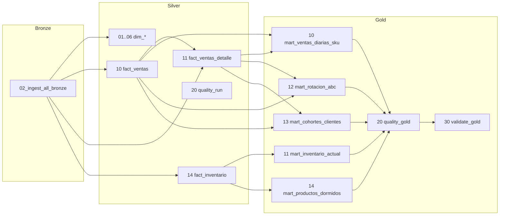

# Plan de Refresco — Gold Marts MotoShop

> **Referencia:** Sprint F3-A, ADR-0015 (DT-F3-1 a DT-F3-8)
> **Workflow:** `motoshop_gold_workflow` — Databricks Job nocturno 02:30 COL
> **Notebooks:** `/Repos/javierportillar/motoshopData/notebooks/gold/`

---

## Resumen de dependencias



---

## 1. mart_ventas_diarias_sku (`10_mart_ventas_diarias_sku.py`)

| Propiedad | Valor |
|-----------|-------|
| **Frecuencia** | Diaria |
| **Partición** | `business_date` |
| **Fuentes** | `silver.fact_ventas_detalle`, `silver.fact_ventas`, `silver.dim_producto`, `silver.dim_bodega` |
| **Dependencias** | `silver/10_fact_ventas`, `silver/11_fact_ventas_detalle` |
| **Tiempo estimado** | ~5 min (depende del volumen diario) |
| **Patrón** | `DELETE WHERE business_date >= '2020-01-01'` + `INSERT` |
| **Idempotente** | ✅ Sí |

### Runbook si falla

1. **Verificar** que `silver.fact_ventas_detalle` y `silver.fact_ventas` tengan datos para el día
2. **Revisar** errores de JOIN: ¿cambió el schema de silver?
3. **Correr** aislado: copiar el SQL del notebook y ejecutar en SQL Editor
4. **Si persiste:** revisar `bronze.detfventas` y `bronze.facventas` en el origen

### Queries de verificación rápida

```sql
-- Conteo y rango de fechas
SELECT COUNT(*) AS rows, MIN(business_date), MAX(business_date) FROM motoshop.gold.mart_ventas_diarias_sku;

-- Top 10 del día más reciente
SELECT * FROM motoshop.gold.mart_ventas_diarias_sku
WHERE business_date = (SELECT MAX(business_date) FROM motoshop.gold.mart_ventas_diarias_sku)
ORDER BY valor_total DESC LIMIT 10;
```

---

## 2. mart_inventario_actual (`11_mart_inventario_actual.py`)

| Propiedad | Valor |
|-----------|-------|
| **Frecuencia** | Diaria |
| **Partición** | Sin partición (snapshot) |
| **Fuentes** | `silver.fact_inventario`, `silver.dim_producto`, `silver.dim_bodega` |
| **Dependencias** | `silver/14_fact_inventario` |
| **Tiempo estimado** | ~3 min |
| **Patrón** | `DELETE` completo + `INSERT` con `ROW_NUMBER()` |
| **Idempotente** | ✅ Sí |

### Runbook si falla

1. **Verificar** que `silver.fact_inventario` tenga datos actualizados
2. **Revisar** el ROW_NUMBER: ¿cambió la granularidad de los datos?
3. **Correr** manualmente con `SELECT ... ROW_NUMBER() ... WHERE rn = 1` para depurar

### Queries de verificación rápida

```sql
SELECT COUNT(*) AS rows, ROUND(SUM(cantidad_actual), 2) AS stock_total FROM motoshop.gold.mart_inventario_actual;
SELECT * FROM motoshop.gold.mart_inventario_actual ORDER BY cantidad_actual DESC LIMIT 10;
```

---

## 3. mart_rotacion_abc (`12_mart_rotacion_abc.py`)

| Propiedad | Valor |
|-----------|-------|
| **Frecuencia** | Diaria (recálculo mensual) |
| **Partición** | `business_month` |
| **Fuentes** | `silver.fact_ventas_detalle`, `silver.fact_ventas`, `silver.dim_producto` |
| **Dependencias** | `silver/10_fact_ventas`, `silver/11_fact_ventas_detalle` |
| **Tiempo estimado** | ~8 min (más pesado por window functions) |
| **Patrón** | `DELETE WHERE business_month >= '2020-01-01'` + `INSERT` con SUM() OVER |
| **Threshold ABC** | A ≤ 80%, B ≤ 95%, C > 95% (DT-F3-7) |
| **Idempotente** | ✅ Sí |

### Runbook si falla

1. **Verificar** que `mart_ventas_diarias_sku` o las fuentes silver tengan datos
2. **Revisar** la window function `SUM() OVER (PARTITION BY business_month ORDER BY ...)`:
   - ¿Hay valores NULL en `valor_total`?
   - ¿Hay productos con `valor_total = 0` que rompen el acumulado?
3. **Depurar** aislado: crear una CTE con los ingresos ordenados y verificar el running total

### Queries de verificación rápida

```sql
SELECT business_month, categoria_abc, COUNT(*) AS productos, ROUND(SUM(valor_total), 2) AS total
FROM motoshop.gold.mart_rotacion_abc
WHERE business_month = (SELECT MAX(business_month) FROM motoshop.gold.mart_rotacion_abc)
GROUP BY business_month, categoria_abc ORDER BY categoria_abc;

-- Verificar que A+B suman <= 95%
SELECT categoria_abc, COUNT(*), ROUND(AVG(porcentaje_acumulado), 2) FROM motoshop.gold.mart_rotacion_abc
WHERE business_month = (SELECT MAX(business_month) FROM motoshop.gold.mart_rotacion_abc)
GROUP BY categoria_abc;
```

---

## 4. mart_cohortes_clientes (`13_mart_cohortes_clientes.py`)

| Propiedad | Valor |
|-----------|-------|
| **Frecuencia** | Diaria (recálculo mensual) |
| **Partición** | `business_month` |
| **Fuentes** | `silver.fact_ventas`, `silver.fact_ventas_detalle` |
| **Dependencias** | `silver/10_fact_ventas`, `silver/11_fact_ventas_detalle` |
| **Tiempo estimado** | ~10 min (pesado por ventana de cohortes) |
| **Patrón** | `DELETE WHERE business_month >= '2020-01-01'` + `INSERT` |
| **SCD** | SCD1 snapshot mensual (DT-F3-6) |
| **Idempotente** | ✅ Sí |

### Runbook si falla

1. **Verificar** que las ventas tengan `nit_cliente` no nulo
2. **Revisar** la ventana `MIN(business_date) OVER (PARTITION BY nit_cliente)`:
   - Si hay clientes con primera compra muy antigua, `meses_desde_cohorte` puede ser grande
3. **Depurar** aislado: extraer clientes con su mes_cohorte primero, luego unir con ventas mensuales

### Queries de verificación rápida

```sql
SELECT COUNT(DISTINCT mes_cohorte) AS cohortes, COUNT(DISTINCT nit_cliente) AS clientes
FROM motoshop.gold.mart_cohortes_clientes;

SELECT mes_cohorte, COUNT(DISTINCT nit_cliente) AS clientes
FROM motoshop.gold.mart_cohortes_clientes
GROUP BY mes_cohorte ORDER BY mes_cohorte;

-- Tasa de retención del mes más reciente
SELECT COUNT(*) AS activos, COUNT(*) * 100.0 / (SELECT COUNT(*) FROM motoshop.gold.mart_cohortes_clientes WHERE business_month = (SELECT MAX(business_month) FROM motoshop.gold.mart_cohortes_clientes)) AS pct_activo
FROM motoshop.gold.mart_cohortes_clientes
WHERE business_month = (SELECT MAX(business_month) FROM motoshop.gold.mart_cohortes_clientes) AND es_activo = TRUE;
```

---

## 5. mart_productos_dormidos (`14_mart_productos_dormidos.py`)

| Propiedad | Valor |
|-----------|-------|
| **Frecuencia** | Diaria |
| **Partición** | Sin partición (snapshot) |
| **Fuentes** | `silver.fact_ventas_detalle`, `silver.fact_ventas`, `silver.fact_inventario`, `silver.dim_producto` |
| **Dependencias** | `silver/10_fact_ventas`, `silver/11_fact_ventas_detalle`, `silver/14_fact_inventario` |
| **Tiempo estimado** | ~5 min |
| **Patrón** | `DELETE` completo + `INSERT` con LEFT JOIN y filtro `> 90 días` (DT-F3-8) |
| **Idempotente** | ✅ Sí |

### Runbook si falla

1. **Verificar** que `fact_ventas_detalle` tenga datos y fechas correctas
2. **Revisar** el cálculo de `dias_sin_venta`: `DATEDIFF(CURRENT_DATE(), MAX(business_date))`
3. **Probar** la query de dormidos separadamente para verificar qué productos califican
4. **Validar** la lógica de "nunca vendido" (NULL en última venta)

### Queries de verificación rápida

```sql
SELECT categoria, COUNT(*) AS productos, ROUND(AVG(dias_sin_venta), 0) AS avg_dias
FROM motoshop.gold.mart_productos_dormidos
GROUP BY categoria;

SELECT * FROM motoshop.gold.mart_productos_dormidos
WHERE categoria = 'dormido_con_stock' AND stock_actual > 10
ORDER BY dias_sin_venta DESC LIMIT 10;
```

---

## Calidad y Validación

### 20_quality_gold.py

| Regla | Severidad | Descripción |
|-------|-----------|-------------|
| `null_pk` | CRITICAL | PK compuesta nula en cualquier mart |
| `negative_*` | CRITICAL | Valores negativos en cantidades/totales |
| `invalid_categoria` | CRITICAL | Categoría ABC o dormidos inválida |
| `future_*` | WARNING | business_date > CURRENT_DATE |
| `empty_mart` | WARNING | Mart sin filas |

**Si el quality run encuentra CRITICAL:** El ASSERT final falla, el pipeline se detiene y se envía notificación a `motoshop@example.com`.

### 30_validate_gold.py

| Test | Descripción |
|------|-------------|
| V1 · Idempotencia | Verifica que ejecutar DELETE+INSERT dos veces produce el mismo resultado |
| V2 · Fechas | Ninguna business_date/business_month > CURRENT_DATE |
| V3 · Coherencia | SUM(valor_total) gold vs SUM(total_factura) silver con tolerancia < 0.5% |

---

## Tiempos estimados totales

| Componente | Tiempo |
|-----------|--------|
| Bronze ingestion | ~10 min |
| Silver notebooks (11) | ~15 min |
| Silver quality | ~2 min |
| Gold marts (5) | ~31 min |
| Gold quality | ~1 min |
| Gold validate | ~1 min |
| **Total estimado** | **~60 min** |

---

## Troubleshooting general

### Síntoma: Mart vacío después de correr

1. **Verificar** que silver tenga datos: `SELECT COUNT(*) FROM motoshop.silver.fact_ventas_detalle`
2. **Revisar** rangos de fecha en DELETE: ¿cubre los datos?
3. **Probar** el INSERT en aislamiento
4. **Correr** `30_validate_gold.py` para diagnóstico

### Síntoma: Error de timeout

1. Aumentar `timeout_seconds` en el job de `3600` a `7200`
2. Dividir el mart problemático en queries más pequeñas
3. Verificar que el SQL Warehouse esté corriendo

### Síntoma: Datos inconsistentes (coherencia silver↔gold falla)

1. **Calcular** diferencia exacta:
   ```sql
   SELECT ROUND(ABS(gold_total - silver_total), 2) AS diff
   FROM (
     SELECT SUM(valor_total) AS gold_total FROM motoshop.gold.mart_ventas_diarias_sku
   ), (
     SELECT SUM(total_factura) AS silver_total FROM motoshop.silver.fact_ventas
   );
   ```
2. **Investigar** si hay facturas anuladas en silver pero no filtradas en gold
3. **Revisar** que el JOIN entre `fact_ventas_detalle` y `fact_ventas` esté correcto

---

## Contacto

- **Responsable:** Data Engineering Team
- **Notificaciones:** `motoshop@example.com`
- **SLA esperado:** Datos listos antes de 06:00 COL (carrera nocturna 02:30 + ~60 min)
