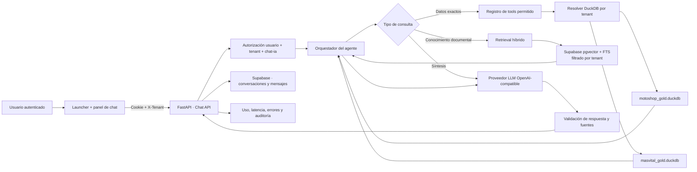

# Plan integral · Agente RAG multiempresa para MotoShop y MasVital

**Estado:** Implementado (primera entrega)  
**Fecha de auditoría:** 2026-09-14  
**Repositorios canónicos:** `frontfambus` (frontend), `motoshopData` (API compartida + ETL MotoShop), `masvitalData` (ETL MasVital)

## Decisión principal

La solución correcta no es un RAG vectorial puro. Se implementará un **agente multi-tenant con dos vías de recuperación**:

1. **Tools tipadas sobre DuckDB** para cifras vivas y exactas: ventas, compras, inventario, rotación, proveedores, vendedores, alertas y caducidad.
2. **RAG híbrido de documentos** —búsqueda semántica + búsqueda por palabras— para políticas, glosario, definiciones de indicadores, manuales y conocimiento no estructurado.

El LLM solo selecciona herramientas, recupera contexto y redacta. **Nunca genera SQL libre, nunca elige la empresa y nunca inventa cifras.** La empresa activa se obtiene de la sesión autenticada y del encabezado `X-Tenant`.

### Resultado esperado

- En computador aparece un botón del asistente en la esquina inferior derecha.
- Al abrirlo, se despliega un panel con conversaciones del usuario y un chat nuevo.
- Al cambiar de MotoShop a MasVital, cambian el nombre, el tono, las herramientas, las fuentes y el historial visible.
- Una conversación de una empresa no puede consultarse desde la otra, aunque se manipule el navegador.
- Cada respuesta cuantitativa informa el corte del dato y las fuentes utilizadas.

---

## 1. Qué existe hoy

| Área | Estado actual | Consecuencia |
|---|---|---|
| Frontend | Next.js en `frontfambus`; autenticación, selector de empresa, `X-Tenant`, features y permisos ya funcionan | La base multiempresa ya existe y debe reutilizarse |
| Chat | Página aislada `app/(authenticated)/chat/page.tsx` con historial solo en memoria del navegador | Al recargar, el usuario pierde la conversación; no existe lista de chats |
| API | `POST /api/llm/qa/chat` y un agente con function calling ya están implementados | No hay que reconstruir el agente desde cero |
| Tools | Diez consultas predefinidas contra DuckDB | Son seguras, pero todavía están centradas en MotoShop |
| Tenant del chat | `get_qa_chat()` abre siempre MotoShop y el prompt dice “asistente de MotoShop” | **Bloqueador crítico:** MasVital puede recibir datos o lenguaje de MotoShop |
| Autorización | La matriz central protege el endpoint con el módulo `analisis` | Debe exigir `chat-ia`, que ya está habilitado para ambas empresas |
| Memoria | Diccionario en proceso con TTL de 30 minutos | Se pierde en cada reinicio de Render y no está aislado por usuario + empresa |
| Proveedor LLM | Cliente HTTP compatible con OpenAI, primario + fallback | Se puede conectar una nueva API key sin acoplar la UI al proveedor |
| Datos analíticos | Un DuckDB por empresa, distribuido por R2 y resuelto por tenant | Es la fuente correcta para respuestas cuantitativas |
| Datos operativos | Supabase/Postgres ya es el sistema de registro para escrituras y usuarios administrados | Es el lugar correcto para conversaciones y el índice documental persistente |

### Problemas que deben corregirse antes de habilitar el chat a usuarios

1. El agente y el `ToolExecutor` están fijados a MotoShop.
2. El prompt del sistema está fijado a una tienda de motopartes.
3. El `conversation_id` no prueba pertenencia al usuario ni al tenant.
4. La memoria en RAM se pierde con el cold start y puede crecer sin persistencia durable.
5. La llamada síncrona al LLM se ejecuta desde un endpoint `async`; debe salir del event loop o migrarse a cliente asíncrono.
6. El error del proveedor puede dejar el registro de uso en un estado inconsistente; el run debe cerrarse explícitamente como éxito o fallo.
7. La UI muestra nombres de tools técnicas, no fuentes comprensibles para el usuario.
8. No existe una vía documental con citas ni un proceso de indexación por empresa.

---

## 2. Tipo de RAG elegido

### Comparación

| Arquitectura | ¿Se usa? | Razón |
|---|---:|---|
| Naive RAG | No | Mezclaría datos transaccionales en embeddings y produciría respuestas desactualizadas o imprecisas |
| Advanced RAG | Parcial | Chunking, filtros, reranking y control de contexto sí son útiles para documentos |
| Hybrid RAG | Sí, para documentos | Combina similitud semántica con búsqueda léxica; recupera nombres exactos, códigos y conceptos |
| Graph RAG | No en el MVP | No existe todavía un grafo empresarial que justifique su costo y complejidad |
| Agentic RAG | **Sí, arquitectura principal** | El agente decide entre tools de datos, recuperación documental o una aclaración |
| Multimodal RAG | No inicialmente | No hay un caso prioritario de imágenes, audio o video |
| Hierarchical RAG | Futuro | Útil si el corpus crece a cientos de manuales o normas extensas |
| Federated RAG | No | Hay una API compartida y un modelo de tenant común; no hace falta un router entre sistemas independientes |
| Real-time RAG | Sí, mediante tools | Los datos recientes se consultan en el DuckDB activo; no se re-embeben ventas cada día |

### Regla de enrutamiento

| Tipo de pregunta | Vía correcta | Ejemplo |
|---|---|---|
| Cifra, comparación o listado operativo | Tool DuckDB tipada | “¿Cuánto vendimos este mes?” |
| Producto, factura o proveedor específico | Tool tipada con filtros validados | “¿Qué pasó con los productos de la factura 13?” |
| Definición, proceso o política | RAG documental híbrido | “¿Cómo calculamos un producto dormido?” |
| Pregunta mixta | Tool + documentos | “¿Por qué esta alerta es crítica y qué debo hacer?” |
| Sin evidencia suficiente | Aclarar o rechazar | “No tengo una fuente habilitada para responder eso” |

**Regla innegociable:** los datos estructurados no se vuelcan en el vector store como reemplazo de las consultas. Los embeddings sirven para encontrar texto; DuckDB sirve para calcular.

---

## 3. Arquitectura objetivo



### Responsabilidad de cada repositorio

| Repositorio | Responsabilidad |
|---|---|
| `frontfambus` | Launcher, panel lateral, historial, composer, estados de carga/error, fuentes y accesibilidad |
| `motoshopData` | API compartida, agente, tools, tenant routing, persistencia, proveedor LLM, RAG, observabilidad y migraciones |
| `masvitalData` | Producir el DuckDB de MasVital y sus tablas analíticas; no crear otra API |

No se debe duplicar el backend dentro de MasVital. La arquitectura vigente ya definió una sola API compartida.

---

## 4. Aislamiento multiempresa y permisos

### Fuente de verdad

1. El navegador envía la cookie de autenticación y `X-Tenant` mediante `apiFetch`.
2. FastAPI resuelve el usuario con `get_current_user`.
3. FastAPI resuelve la empresa con `get_tenant`; no acepta `tenant_id` del body.
4. Se valida que el usuario tenga acceso a esa empresa y al módulo `chat-ia`.
5. Cada consulta a conversaciones, mensajes y chunks incluye `tenant_id` y `user_id`.
6. El servidor valida la propiedad de `conversation_id`; un UUID conocido no concede acceso.

### Claves de aislamiento

La clave lógica de una conversación es:

```text
tenant_id + user_id + conversation_id
```

No basta con `conversation_id`. Tampoco se debe reutilizar memoria cuando el usuario cambia de empresa.

### Matriz de permisos

| Acción | Usuario con `chat-ia` | Administrador |
|---|---:|---:|
| Crear y leer sus chats | Sí | Sí |
| Leer chats de otro usuario | No | No por defecto |
| Consultar datos de tenant no autorizado | No | Solo si ese tenant está en su sesión |
| Reindexar documentos | No | Sí, endpoint administrativo |
| Ver consumo agregado | No | Sí |

Si se requiere supervisión futura, debe diseñarse como una función separada, auditable y explícita; no como acceso silencioso a conversaciones ajenas.

---

## 5. Persistencia necesaria en Supabase/Postgres

### `agent_conversations`

| Campo | Uso |
|---|---|
| `id uuid` | Identificador del chat |
| `tenant_id text` | Empresa propietaria |
| `user_id text` | Usuario propietario |
| `title text` | Título corto generado después del primer turno |
| `status text` | `active` o `archived` |
| `created_at`, `updated_at`, `last_message_at` | Orden e historial |
| `message_count int` | Control de límites |

Índice principal: `(tenant_id, user_id, last_message_at desc)`.

### `agent_messages`

| Campo | Uso |
|---|---|
| `id uuid` | Identificador del mensaje |
| `conversation_id uuid` | Conversación propietaria |
| `tenant_id`, `user_id` | Defensa en profundidad y consultas eficientes |
| `role text` | `user`, `assistant`, `tool` |
| `content text` | Contenido visible o resultado interno controlado |
| `sources jsonb` | Fuentes, fechas de corte y referencias |
| `tool_calls jsonb` | Tools ejecutadas y argumentos saneados |
| `model`, `provider` | Auditoría técnica |
| `tokens_input`, `tokens_output`, `latency_ms` | Costo y rendimiento |
| `status`, `error_code` | Éxito, timeout, rechazo o fallo |
| `request_id`, `created_at` | Idempotencia y trazabilidad |

No se guardan secretos, prompts internos completos ni datos personales innecesarios.

### Tablas del RAG documental

| Tabla | Propósito |
|---|---|
| `rag_documents` | Fuente, tenant, versión, checksum, vigencia y estado de indexación |
| `rag_chunks` | Texto, metadatos, `tsvector` y embedding `vector(n)` |
| `rag_ingestion_runs` | Inicio, fin, documentos procesados, errores y versión del modelo de embeddings |

Todos los índices y consultas se filtran por `tenant_id` antes de calcular similitud.

---

## 6. Conocimiento que sí debe indexarse

### Común

- Definiciones de KPIs y reglas de negocio.
- Manual de uso de cada módulo.
- Glosario de términos.
- Política de compras, inventario y devoluciones.
- Procedimientos operativos aprobados.
- Descripción y alcance de las fuentes de datos.

### MotoShop

- Taxonomía de repuestos, grupos, líneas y equivalencias aprobadas.
- Criterios de rotación, productos dormidos, forecast y reposición.
- Políticas de proveedores y compra, si están documentadas.

### MasVital

- Catálogo y taxonomía propios.
- Políticas de caducidad, lotes y alertas.
- Procedimientos de inventario y compra propios.

### No indexar

- Ventas diarias, stock actual o totales que cambian con frecuencia.
- Credenciales, tokens o archivos `.env`.
- PII de clientes o empleados sin necesidad explícita.
- Respuestas generadas por el LLM como si fueran fuente de verdad.

---

## 7. Pipeline del RAG documental

1. **Registrar fuente:** archivo o URL aprobada, tenant, tipo y sensibilidad.
2. **Extraer:** texto limpio conservando título, sección y referencia.
3. **Versionar:** calcular checksum; si no cambió, no reindexar.
4. **Dividir:** chunks por encabezado y párrafo, con solapamiento moderado; no cortar tablas o definiciones a la mitad.
5. **Enriquecer metadata:** tenant, documento, sección, fecha de vigencia, URL y permisos.
6. **Generar embeddings:** mismo modelo para documentos y queries.
7. **Persistir:** `rag_chunks` en Supabase pgvector y campo léxico `tsvector`.
8. **Recuperar:** top semántico + top léxico, fusionar rankings y eliminar duplicados.
9. **Rerank opcional:** activar solo si las evaluaciones prueban que mejora precisión.
10. **Citar:** devolver título, sección, fecha y enlace; nunca mostrar un chunk sin origen.

### Por qué Supabase pgvector

| Opción | Ventaja | Riesgo | Decisión |
|---|---|---|---|
| Supabase pgvector | Persistente, ya existe, filtros tenant y FTS en el mismo motor | Requiere migración e índices | **Recomendada** |
| DuckDB VSS | Reutiliza archivos actuales | Actualizaciones y concurrencia de documentos son menos cómodas | Mantener para búsqueda de catálogo existente, no como memoria del chat |
| Chroma local, como Qbano | Fácil para una demo | Disco efímero en Render, otra base y aislamiento manual | No usar en producción |

El proyecto de Sándwich Qbano sirve como referencia para chunking, recuperación híbrida, tools tipadas, memoria durable y evaluación. No se copia su despliegue local con Chroma/Postgres Docker porque esta plataforma ya tiene Render, Supabase, R2 y dos tenants.

---

## 8. Orquestador del agente

### Flujo de un turno

1. Validar usuario, tenant, módulo y propiedad de la conversación.
2. Cargar los últimos mensajes necesarios desde Supabase.
3. Construir un `TenantAgentContext` con perfil, herramientas autorizadas, fecha de datos y límites.
4. Clasificar la intención de forma determinística cuando sea obvia.
5. Permitir al LLM elegir solo entre las tools del tenant y la tool de recuperación documental.
6. Ejecutar como máximo el número configurado de iteraciones.
7. Reunir resultados y fuentes.
8. Pedir al LLM una respuesta breve sustentada únicamente en ese contexto.
9. Validar que las cifras y citas estén respaldadas.
10. Persistir el turno, métricas y estado.

### Perfil por empresa

`tenants.yaml` debe ampliarse con un bloque de agente:

```yaml
agent:
  display_name: "Asistente de MotoShop"
  business_description: "..."
  locale: "es-CO"
  currency: "COP"
  enabled_tools:
    - sales_summary
    - inventory_summary
    - purchase_analysis
  knowledge_namespace: "motoshop"
```

MasVital tendrá su propio perfil y tools. El prompt se construye desde esta configuración; no habrá textos fijos de MotoShop dentro del orquestador.

### Catálogo inicial de tools

#### Comunes

- `get_data_freshness`
- `get_sales_summary`
- `compare_sales_periods`
- `get_top_products`
- `get_product_detail`
- `get_inventory_summary`
- `get_low_rotation_products`
- `get_purchase_document_analysis`
- `search_business_knowledge`

#### MotoShop

- `get_seller_performance`
- `get_stockout_alerts`
- `get_forecast_summary`
- `get_supplier_purchase_analysis`

#### MasVital

- `get_expiry_risk`
- `get_expiry_lots`
- `get_catalog_availability`

Cada tool define un schema Pydantic, rangos máximos, columnas permitidas, timeout y respuesta JSON acotada. Ninguna recibe SQL.

---

## 9. Proveedor del modelo

### Requisitos obligatorios

- API compatible con `chat/completions` o un adaptador equivalente.
- Function/tool calling confiable.
- Buena respuesta en español.
- Límites y precios conocidos.
- Timeout, rate limit y errores distinguibles.
- Tratamiento contractual de los datos compatible con el negocio.

### Configuración propuesta

```text
AGENT_PRIMARY_API_BASE
AGENT_PRIMARY_API_KEY
AGENT_PRIMARY_MODEL
AGENT_FALLBACK_API_BASE
AGENT_FALLBACK_API_KEY
AGENT_FALLBACK_MODEL
AGENT_TIMEOUT_SECONDS
AGENT_MAX_OUTPUT_TOKENS
EMBEDDING_API_BASE
EMBEDDING_API_KEY
EMBEDDING_MODEL
```

La key vive únicamente en variables de entorno de Render y GitHub Actions. Nunca llega al frontend, a los logs ni a Supabase.

Si el proveedor elegido no soporta embeddings, se puede usar otro proveedor de embeddings o un modelo abierto; **chat y embeddings son dependencias separadas**.

---

## 10. Contrato de API

### Conversaciones

| Método | Ruta | Propósito |
|---|---|---|
| `POST` | `/api/llm/chat/conversations` | Crear conversación para usuario + tenant actuales |
| `GET` | `/api/llm/chat/conversations` | Listar conversaciones propias del tenant activo |
| `GET` | `/api/llm/chat/conversations/{id}/messages` | Cargar mensajes con paginación |
| `PATCH` | `/api/llm/chat/conversations/{id}` | Renombrar o archivar |
| `DELETE` | `/api/llm/chat/conversations/{id}` | Borrado lógico o eliminación según política |

### Mensajes

`POST /api/llm/chat/conversations/{id}/messages`

```json
{
  "message": "¿Qué productos están frenando el inventario?",
  "request_id": "uuid",
  "ui_context": {
    "route": "/dashboards/inventario"
  }
}
```

Respuesta mínima:

```json
{
  "message_id": "uuid",
  "conversation_id": "uuid",
  "answer": "...",
  "sources": [
    {"type": "data", "label": "Inventario", "as_of": "2026-09-14"}
  ],
  "tools_used": ["get_inventory_summary"],
  "data_as_of": "2026-09-14"
}
```

`ui_context` es opcional y se limita a rutas o identificadores explícitamente permitidos. No se envía el DOM ni contenido arbitrario de la pantalla.

El endpoint actual `/api/llm/qa/chat` se mantiene durante la transición y luego se retira con telemetría que confirme que ningún cliente lo usa.

---

## 11. Experiencia de usuario

### Computador

1. `AssistantLauncher` fijo abajo a la derecha, visible solo con permiso `chat-ia`.
2. Al pulsarlo, abre un `ChatDrawer` lateral derecho sin abandonar la pantalla actual.
3. Cabecera: empresa activa, botón “Nuevo chat”, minimizar y cerrar.
4. Vista de conversaciones: título, última actividad y opción de archivar.
5. Vista de mensajes: respuesta, corte de datos y bloque desplegable “Fuentes utilizadas”.
6. Composer: texto, enviar, cancelar solicitud y estados de error recuperables.
7. La ruta `/chat` permanece como vista completa y reutiliza los mismos componentes.

### Móvil

- Botón flotante por encima de la navegación inferior.
- Chat en hoja inferior o pantalla completa con `100dvh`.
- Teclado no debe tapar el composer.
- El historial se abre como panel secundario, no como columna permanente.

### Cambio de empresa

- Cerrar o reiniciar el estado local del panel.
- Cancelar requests del tenant anterior.
- Cargar únicamente conversaciones del nuevo tenant.
- Mostrar el nombre y color de la empresa activa.
- Nunca trasladar un `conversation_id` de un tenant a otro.

### Accesibilidad y seguridad visual

- Navegación por teclado, foco atrapado en el drawer, `Escape` para cerrar y etiquetas ARIA.
- Markdown limitado y sanitizado; no renderizar HTML del modelo.
- Links externos con advertencia y atributos seguros.
- Errores en lenguaje claro: sin stacktraces ni contenido del proveedor.

---

## 12. Cambios previstos por repositorio

### `motoshopData`

**Modificar**

- `motoshop-app/api/src/motoshop_api/llm/router.py`
- `motoshop-app/api/src/motoshop_api/llm/qa_chat.py`
- `motoshop-app/api/src/motoshop_api/llm/tools.py`
- `motoshop-app/api/src/motoshop_api/llm/client.py`
- `motoshop-app/api/src/motoshop_api/auth/module_access.py`
- `motoshop-app/api/tenants.yaml`

**Crear**

- `llm/context.py` — contexto inmutable de usuario + tenant
- `llm/orchestrator.py` — loop del agente
- `llm/tool_registry.py` — tools comunes y específicas por tenant
- `llm/retrieval.py` — búsqueda híbrida y citas
- `llm/prompts.py` — prompts construidos desde perfil de tenant
- `llm/conversations/repo.py` — interfaz de persistencia
- `llm/conversations/repo_supabase.py` — implementación
- `infra/migrations/*_agent_chat.sql`
- `scripts/index_business_knowledge.py`
- pruebas unitarias, de integración, seguridad y aislamiento

### `frontfambus`

**Modificar**

- `app/(authenticated)/layout.tsx` — montar el launcher global
- `app/(authenticated)/chat/page.tsx` — reutilizar la experiencia nueva
- `lib/api/client.ts` — mantener tenant y cancelación segura
- `lib/auth/access.ts` — proteger `/chat` con `chat-ia`
- `lib/api/hooks.ts` — retirar el hook de chat antiguo después de migrar

**Crear**

- `components/chat/AssistantLauncher.tsx`
- `components/chat/ChatDrawer.tsx`
- `components/chat/ConversationList.tsx`
- `components/chat/MessageList.tsx`
- `components/chat/MessageComposer.tsx`
- `components/chat/SourcesPanel.tsx`
- `lib/api/chat.ts`
- `lib/chat/store.ts`
- pruebas de componentes, accesibilidad y E2E

### `masvitalData`

- Confirmar que los marts requeridos por las tools de MasVital existen y son estables.
- Añadir marts o vistas para caducidad y lotes solo si las queries actuales no cubren el contrato.
- Mantener el upload a R2 y la misma convención de `snapshot_date`.
- No añadir endpoints HTTP ni lógica de conversación.

---

## 13. Seguridad y privacidad

- Mantener tools tipadas; rechazar SQL libre aunque el usuario lo solicite.
- Whitelist de tablas, columnas, filtros, límites y horizontes temporales por tool.
- No enviar NIT de clientes, teléfonos, correos ni campos sensibles al proveedor.
- Reducir resultados antes de llamar al LLM; enviar agregados y top-N, no tablas completas.
- Protección contra prompt injection en mensajes y documentos recuperados.
- Tratar los chunks como datos no confiables: nunca pueden modificar reglas del sistema.
- Rate limit por usuario y tenant, no solo por IP.
- Límite de turnos, tool calls, tokens y tiempo por solicitud.
- Idempotencia con `request_id` para evitar mensajes y cargos duplicados.
- Log de auditoría sin prompts secretos ni resultados sensibles completos.
- Endpoint de reindexación solo para administrador o machine token con tenant explícito.
- Borrado y retención configurables para conversaciones.

### Amenazas que las pruebas deben intentar

1. Reutilizar un `conversation_id` de otro usuario.
2. Cambiar `X-Tenant` a una empresa no autorizada.
3. Pedirle al modelo que ignore el tenant.
4. Solicitar SQL, credenciales o datos personales.
5. Inyectar instrucciones maliciosas dentro de un documento del RAG.
6. Forzar listados masivos para extraer la base completa.
7. Duplicar una solicitud durante timeout o reconexión.

---

## 14. Observabilidad

Cada turno debe producir:

- `request_id`, tenant, usuario hash o identificador interno.
- Conversación y mensaje.
- Ruta elegida: tool, RAG, mixta, aclaración o rechazo.
- Tools usadas, duración y filas devueltas.
- Proveedor, modelo, tokens y costo estimado.
- Fecha de corte de cada fuente.
- Resultado: éxito, timeout, rate limit, fallo de datos o fallo del proveedor.
- Feedback opcional del usuario: útil / no útil.

Alertas mínimas:

- errores por encima del umbral acordado;
- latencia p95 fuera del objetivo;
- consumo diario o mensual fuera del presupuesto;
- intento de acceso cruzado entre tenants;
- índice documental desactualizado;
- DuckDB no disponible durante cold start.

---

## 15. Pruebas y evaluación

### Unitarias

- Resolución de tenant y tool registry.
- Prompts específicos por empresa.
- Validación de argumentos y límites de tools.
- Propiedad de conversación.
- Filtros obligatorios por tenant en documentos y chunks.
- Fallback del proveedor y cierre correcto del uso.

### Integración

- Dos DuckDB fixture con cifras deliberadamente distintas; la misma pregunta debe devolver la cifra del tenant activo.
- Dos usuarios con conversaciones independientes.
- Reinicio del proceso sin perder historial.
- Índice documental con documentos homónimos en ambos tenants; recuperación sin cruce.
- Cold start de DuckDB devuelve estado recuperable, no una respuesta inventada.

### E2E frontend

- Launcher visible solo con `chat-ia`.
- Abrir, minimizar, cambiar conversación, crear y archivar.
- Cambiar de empresa mientras el panel está abierto.
- Recargar y recuperar historial.
- Comportamiento en computador y móvil.
- Teclado, foco, lector de pantalla y cancelación.

### Evaluación del agente

Crear un conjunto dorado separado por empresa con preguntas de:

- ventas y comparaciones;
- compras e inventario;
- producto específico;
- conocimiento documental;
- pregunta ambigua;
- pregunta imposible;
- prompt injection;
- intento de acceso cruzado.

Métricas de salida:

- exactitud de cifras;
- selección correcta de tool;
- citas completas;
- tasa de respuesta sin evidencia;
- fuga cross-tenant: **cero tolerancia**;
- latencia y costo por turno;
- evaluación humana de utilidad.

---

## 16. Plan de ejecución

### Fase 0 · Decisiones y contratos

**Objetivo:** congelar límites antes de escribir código.

- Crear ADR del agente multi-tenant y RAG híbrido.
- Crear ADR de persistencia y privacidad de conversaciones.
- Elegir proveedor con tool calling y fijar presupuesto.
- Aprobar fuentes documentales por empresa.
- Aprobar retención de conversaciones.

**Salida:** contrato API, schema SQL, tool catalog y threat model aprobados.

### Fase 1 · Corregir el agente actual

**Objetivo:** lograr aislamiento real sin añadir todavía el vector RAG.

- Resolver tenant en el endpoint.
- Cambiar módulo de autorización a `chat-ia`.
- Construir prompt y ToolExecutor por tenant.
- Mover trabajo síncrono fuera del event loop o usar cliente async.
- Añadir tool de frescura de datos.
- Probar MotoShop y MasVital con fixtures distintos.

**Salida:** el chat existente responde con los datos correctos de ambas empresas.

### Fase 2 · Persistencia por usuario

**Objetivo:** conversaciones durables y seguras.

- Aplicar migración de Supabase.
- Implementar repositorio de conversaciones y mensajes.
- Verificar propiedad en cada endpoint.
- Añadir idempotencia, paginación, título y archivo.
- Migrar el endpoint actual a los nuevos contratos.

**Salida:** historial sobrevive deploys y está aislado por usuario + tenant.

### Fase 3 · Launcher y panel lateral

**Objetivo:** chat disponible desde cualquier módulo.

- Crear componentes compartidos.
- Montar launcher en el layout autenticado.
- Añadir lista de chats, nuevo chat, fuentes y errores.
- Reusar los componentes en `/chat`.
- Implementar cambio seguro de tenant y experiencia móvil.

**Salida:** experiencia aprobada en desktop y móvil.

### Fase 4 · RAG documental híbrido

**Objetivo:** responder políticas y conocimiento no estructurado con citas.

- Crear tablas pgvector/FTS.
- Implementar ingestión versionada.
- Cargar un corpus pequeño y aprobado por tenant.
- Implementar fusión léxica + semántica.
- Añadir tool `search_business_knowledge`.
- Mostrar fuentes en la UI.

**Salida:** evaluación documental aprobada sin cruces entre empresas.

### Fase 5 · Tools de negocio y calidad

**Objetivo:** cubrir las preguntas que realmente hacen los usuarios.

- Ampliar tools comunes y específicas.
- Añadir análisis de compras/facturas y caducidad.
- Construir set dorado y pruebas adversariales.
- Ajustar prompts usando errores medidos, no intuición.

**Salida:** exactitud y utilidad dentro de los umbrales acordados.

### Fase 6 · Producción gradual

**Objetivo:** activar sin exponer a toda la organización de una vez.

1. Administrador interno en MotoShop.
2. Administrador interno en MasVital.
3. Grupo pequeño de usuarios con `chat-ia`.
4. Resto de usuarios autorizados.

Monitorear por fase y mantener kill switch por tenant.

---

## 17. Definition of Done

- [ ] La misma pregunta devuelve datos diferentes y correctos según el tenant activo.
- [ ] Cero acceso a chats, tools o documentos de otro tenant.
- [ ] El endpoint exige `chat-ia` en frontend y backend.
- [ ] El historial persiste después de reinicios y deploys.
- [ ] Cada usuario ve solo sus conversaciones.
- [ ] El launcher funciona en computador y móvil.
- [ ] Cada cifra tiene tool/fuente y fecha de corte.
- [ ] El agente rechaza preguntas sin evidencia suficiente.
- [ ] No existe SQL generado por el LLM.
- [ ] API keys ausentes del código, cliente y logs.
- [ ] Pruebas unitarias, integración, E2E y seguridad pasan.
- [ ] Set dorado aprobado por un responsable de cada empresa.
- [ ] Observabilidad, presupuesto, fallback y kill switch están operativos.
- [ ] Runbook de incidentes y rollback está documentado.

---

## 18. Orden recomendado y criterio de compra tecnológica

Primero debe cerrarse **Fase 1 + Fase 2**. Un vector database no arregla un chat que todavía apunta siempre a MotoShop o cuya memoria no pertenece a un usuario. Después se construye la experiencia lateral y recién entonces se añade el RAG documental.

La API key del proveedor se compra o configura cuando haya pasado una prueba corta de:

1. function calling;
2. español;
3. latencia;
4. costo por 100 preguntas reales;
5. manejo de errores;
6. política de datos.

La decisión de proveedor no debe cambiar la arquitectura: el backend conserva un adaptador OpenAI-compatible y un fallback independiente.

## Siguientes pasos operativos

Aplicar la migración en Supabase, cargar documentos por tenant con `scripts/index_business_knowledge.py`, configurar las API keys en el entorno de despliegue y ejecutar una prueba E2E con un usuario de cada empresa.
# Estado de implementación (2026-09-14)

La primera entrega ejecutable quedó aplicada en el backend y frontend: perfil de agente por tenant, tools DuckDB tenant-safe, recuperación híbrida Supabase (pgvector + FTS), conversaciones persistentes con fallback en memoria, endpoints de historial, migración SQL, script de indexación y launcher/drawer responsive en la interfaz autenticada. La indexación documental requiere aplicar la migración y configurar las credenciales del proveedor de embeddings antes de cargar fuentes.
