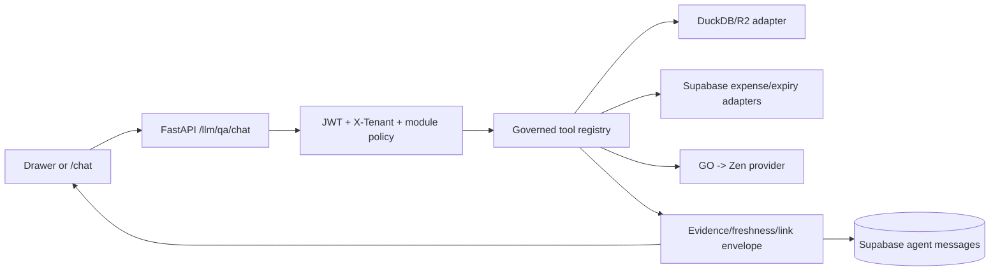
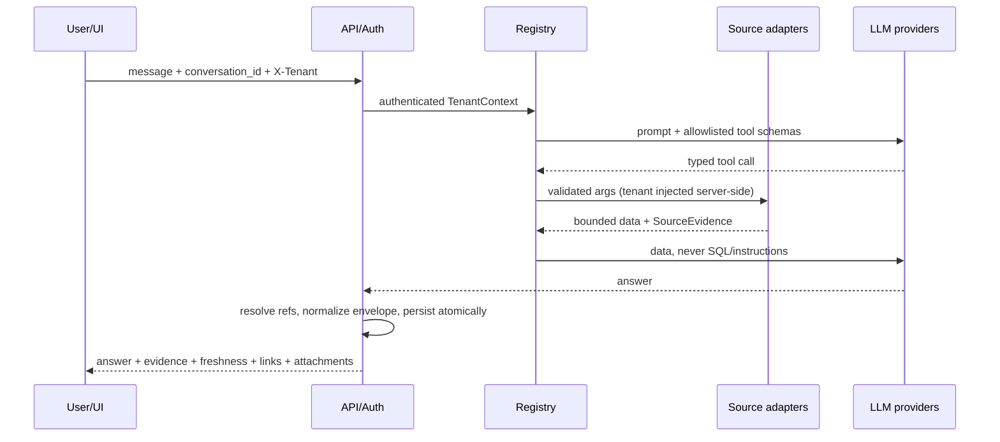

# Design: Cross-module business assistant

## Technical Approach

Add a governed assistant service around the existing FastAPI Q&A loop. A registry exposes only tenant-enabled, read-only domain capabilities; each capability calls a canonical repository/query specification with typed Pydantic input, fixed columns, parameter binding, row/time limits, and a source adapter. The model never receives table names, SQL, or URL authority. Every response is normalized before persistence and delivery.

## Architecture Decisions

| Decision | Alternatives / trade-off | Choice and rationale |
|---|---|---|
| Domain registry + query catalog | Arbitrary read-only SQL is broader but cannot reliably enforce joins, columns, limits, or tenant predicates. Existing REST calls duplicate UI coupling. | Use `llm/registry.py` and `llm/catalog.py`; fixed parameterized query builders preserve business definitions and make security testable. |
| Per-source adapters | One “latest date” is simpler but lies across mixed sources; direct Supabase calls from tools leak provider concerns. | DuckDB uses `_make_db_path(tenant)`/canonical metrics repos; expenses and MasVital expiry use dedicated read-only adapters. Each returns independent cutoff, observed time, citation, and status. |
| Server-resolved entity refs | Model-generated URLs are convenient but enable path/IDOR leakage; client-only route maps are not authorization. | Accept only typed `{entity_type, entity_id, route_key}`; backend allowlist resolves the route and rechecks tenant/module access. Reject raw URLs and cross-tenant refs. |
| Additive envelope persistence | Replacing `sources` breaks old history; ephemeral attachments disappear on restart. | Add JSONB `evidence`, `freshness`, `entity_refs`, `attachments`, and `status` to `agent_messages`, retaining legacy fields during migration. |

## Data Flow

`AssistantEnvelope` contains `tenant_id`, `answer`, `status` (`complete|partial|unavailable`), `sources[]` (`kind`, `owner`, `cutoff_at`, `observed_at`, `citations`, `status`, `reason`), `entity_refs[]`, and explicit-request-only `attachments[]` (`report_id`, format, expiry, download route). Optional source failure yields `partial` with a truthful reason; required source failure maps to 503 (DuckDB loading/Supabase unavailable) or 502 (provider/upstream rejection). No missing value is synthesized. GO/Zen exhaustion follows existing transient 503/Retry-After 30 and permanent 502 behavior.

Purchase plans are **not registered**. Before enabling them, migrate the authoritative store to a tenant-keyed repository/table with `tenant_id NOT NULL`, tenant-scoped unique/index constraints, and every create/list/get/update predicate `(tenant_id, id)`; backfill only verified records. The current process-global fake and `app_purchase_plans` schema are not assistant sources.

## File Changes

| File | Action | Description |
|---|---|---|
| `motoshop-app/api/src/motoshop_api/llm/{contracts,registry,catalog,sources}.py` | Create | Envelope, capability policy, fixed query catalog, DuckDB/Supabase adapters. |
| `llm/tools.py`, `llm/qa_chat.py`, `llm/router.py` | Modify | Delegate through registry; normalize/persist envelope and validate explicit reports. |
| `llm/conversations/repository.py` | Modify | Atomic envelope persistence and tenant/user ownership checks. |
| `infra/supabase/migrations/20260914_001_agent_chat.sql` | Modify | Additive JSONB metadata/index/check migration. |
| `auth/tenant_dep.py`, `auth/module_access.py`, `tenants.yaml` | Modify | Central `TenantContext`, capability flags, fail-closed policy. |
| `reports/` | Modify | Persist report metadata; retain TTL and tenant-checked download. |
| `../frontfambus/lib/api/chat.ts`, chat drawer/page, `lib/auth/access.ts` | Modify | One typed response model, evidence/freshness/ref links, expired attachment state, parity. |

## Testing Strategy

Strict TDD: RED first. Unit-test registry allowlists, typed validation, parameter binding, evidence aggregation, ref rejection, explicit-file intent, provider classification, and purchase-plan exclusion. Integration-test FastAPI with per-tenant DuckDB fixtures and fake Supabase, including cross-tenant conversations, expenses, expiry, reports, R2 cold-start 503, and partial sources. Vitest tests both clients against the same fixtures; Playwright covers drawer/full-page parity, tenant switching, links, expiry, and retry UX. Run targeted tests, then configured backend and frontend suites.

## Migration / Rollout

Use additive migration, deploy backend contract first, then frontend consumers, then enable `chat-ia` canaries per tenant. Observe source/provider/error metrics before widening. Rollback disables the tenant capability flag and reverts consumers; retain source data and additive columns. Do not enable purchase-plan tools during rollback or rollout.

## Observability and Open Questions

Emit request-correlated structured events and counters for tool/source latency, freshness age, partial/unavailable responses, denied refs, provider fallback, report generation, and tenant—never prompts, secrets, or raw rows. Alert on cross-tenant denial anomalies and repeated source failures.

- [ ] Confirm authoritative destination and migration owner for purchase plans.
- [ ] Confirm Supabase retention/RLS policy for the new message metadata.
